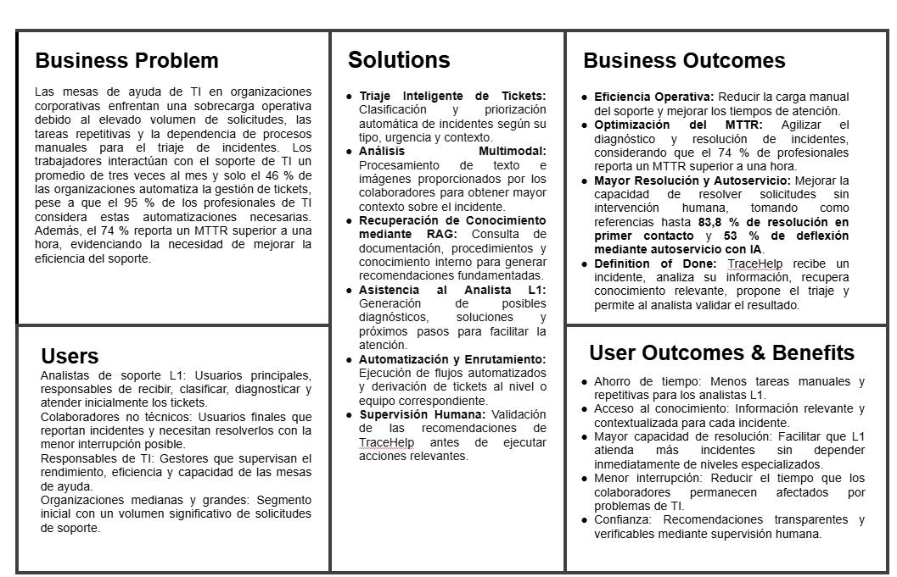

# Capítulo I: Introducción

## 1.1. Startup Profile

### 1.1.1. Descripción de la Startup

**Silph Technologies** es una startup tecnológica fundada por estudiantes de la Universidad Peruana de Ciencias Aplicadas (UPC), enfocada en la automatización del soporte de TI corporativo mediante inteligencia artificial. Su principal solución, **TraceHelp**, es un asistente inteligente de triaje y soporte de primer nivel que emplea arquitecturas RAG (*Retrieval-Augmented Generation*) e IA multimodal para analizar consultas y capturas de pantalla de errores, generando respuestas basadas exclusivamente en la documentación real de cada empresa.

* **Misión:** Optimizar el soporte técnico corporativo mediante IA multimodal y RAG, reduciendo los tiempos de atención, los errores y la carga de trabajo de los analistas.
* **Visión:** Convertirse en un referente latinoamericano en la optimización de operaciones de TI mediante inteligencia artificial y arquitecturas de software emergentes.

Nuestra iniciativa está fuertemente comprometida con el desarrollo sostenible, alineándose con dos pilares de las Naciones Unidas:
* **ODS 8 – Trabajo Decente y Crecimiento Económico:** La automatización de consultas e incidentes repetitivos busca disminuir la sobrecarga y el burnout de los analistas, permitiéndoles enfocarse en actividades de mayor valor.
* **ODS 9 – Industria, Innovación e Infraestructura:** La empresa promueve la adopción de tecnologías como IA generativa, RAG, bases de datos vectoriales y arquitecturas modernas para mejorar la eficiencia y resiliencia de la infraestructura tecnológica empresarial.

---

### 1.1.2. Perfiles de integrantes del grupo

| Nombre | Código | Descripción |
| :--- | :---: | :--- |
| **Cassius Estefano Martel Andrade** | u202312287 | Mi nombre es Cassius Martel y soy estudiante de séptimo ciclo de la carrera de Ingeniería de Software. Me caracterizo por ser un líder nato que siempre busca sacar lo mejor de cada uno de sus compañeros de equipo, así como por ser sumamente responsable y atento con los requerimientos de cada proyecto en el que me involucro. Tengo conocimientos técnicos en lenguajes como Python, Java, C++, así como en diversos frameworks de desarrollo Frontend, bases de datos y metodologías ágiles. |
| **Gabriel Sebastián Borja Molina** | u202310308 | Estudiante de la carrera de Ingeniería de Software de la UPC. Posee un perfil enfocado en el análisis y modelado de dominio (DDD), especificación de requerimientos de software y diseño de arquitecturas orientadas a eventos, destacando por su capacidad de comunicación técnica y colaboración en equipos de desarrollo ágil. |
| **Marcelo Alejandro Binda Arbañil** | u202311157 | Estudiante de la carrera de Ingeniería de Software de la UPC. Se especializa en el diseño de arquitecturas guiadas por atributos (ADD), evaluación de tácticas arquitectónicas y análisis de compensaciones técnicas (*trade-offs*), con sólidos conocimientos en ingeniería de software y desarrollo de sistemas empresariales. |
| **Ario Joel Chavez Uribe** | u202213468 | Estudiante de la carrera de Ingeniería de Software de la UPC. Cuenta con experiencia en elicitación de requerimientos, diseño de experiencia de usuario (UX/UI), entrevistas con usuarios y desarrollo de soluciones tecnológicas innovadoras, asegurando el alineamiento entre las necesidades del usuario y la propuesta de valor del software. |

---

## 1.2. Solution Profile

### 1.2.1. Antecedentes y problemática

La gestión de servicios de tecnología de la información (ITSM, por sus siglas en inglés) dentro del entorno corporativo enfrenta una creciente presión operativa debido al aumento de las demandas de soporte y la persistencia de procesos manuales. Según Ivanti (2024), los trabajadores interactúan con el soporte de TI un promedio de tres veces al mes y el 47 % aún utiliza el teléfono para solicitar asistencia. Sin embargo, solo el 46 % de las organizaciones automatiza la gestión de tickets, pese a que el 95 % de los profesionales de TI considera estas automatizaciones necesarias para trabajar eficientemente. Asimismo, el 49 % de los ingenieros señala que sus herramientas requieren demasiado trabajo manual y el 43 % recibe alertas sin suficiente contexto para comprender y realizar el triaje de los problemas (Chronosphere, 2024). En paralelo, el 74 % de los profesionales encuestados por la Cloud Native Computing Foundation reportó un MTTR superior a una hora (CNCF, 2024). Estos datos evidencian una oportunidad para automatizar tareas repetitivas y mejorar el acceso a información contextualizada durante la atención de incidentes. En este contexto, surge TraceHelp, un asistente inteligente de triaje y soporte corporativo desarrollado por Silph Technologies, concebido para integrar flujos de trabajo basados en AIOps y arquitecturas de Generación Aumentada por Recuperación (RAG).

Para comprender la magnitud de esta problemática y fundamentar la pertinencia de TraceHelp, se emplea el marco analítico de las **5W' y 2H'**, permitiendo identificar los principales vectores de ineficiencia y delimitar la brecha tecnológica que la solución busca abordar.

#### What: Definición del Problema y su Relación con la Persona
* **¿Cuál es el problema?**  
  El problema central radica en la creciente carga operativa de las mesas de ayuda de TI de primer nivel (L1), causada por el elevado volumen de solicitudes y la persistencia de tareas repetitivas susceptibles de automatización. Actividades como el restablecimiento de contraseñas, la resolución de problemas básicos y la categorización de tickets consumen recursos que podrían destinarse a incidentes de mayor complejidad (Ivanti, 2024). Además, la falta de contexto durante el diagnóstico dificulta el triaje y prolonga la resolución de incidentes. En este sentido, Freshworks reporta que las mesas de ayuda que automatizan más de 50 escenarios pueden alcanzar una resolución en el primer contacto de hasta 83,8 % (Freshworks, 2024). Por ello, el problema afecta directamente a los analistas L1, quienes deben gestionar tareas repetitivas y recopilar manualmente información para resolver incidentes, generando una oportunidad para automatizar el triaje y mejorar la eficiencia del soporte.
* **¿Cuál es la relación con la persona en cuestión?**  
  La relación de esta problemática con el factor humano es directa, afectando tanto a los analistas de soporte como a los colaboradores que dependen de estos servicios. Para los analistas L1, la alta carga de solicitudes y la interacción constante con herramientas tecnológicas pueden generar tecnoestrés, especialmente en forma de *techno-overload* y *techno-complexity*, asociados con efectos negativos sobre el bienestar y el agotamiento laboral (Mansuroğlu & Smith, 2026; Quartucci et al., 2023).  
  Para el colaborador no técnico, la problemática se manifiesta en interrupciones y pérdida de tiempo productivo al depender del soporte para resolver incidentes. Un análisis de más de 50 000 tickets encontró que el 22 % correspondía a situaciones en las que el empleado no podía realizar su trabajo hasta resolver el problema, mientras que estos tickets presentaban casi cinco veces más sentimiento negativo (Fixify, 2026). En consecuencia, las deficiencias del soporte pueden afectar tanto el bienestar de los analistas como la productividad y experiencia de los usuarios finales.

#### Who: Actores Involucrados y Afectados
* **¿Quiénes están involucrados?**  
  La problemática del soporte técnico corporativo involucra a cuatro grupos principales:
  * **Analistas de Soporte de Nivel 1 (L1):** Son la primera línea de atención y concentran gran parte del volumen de solicitudes. La falta de automatización y las tareas repetitivas incrementan su carga operativa, mientras que una menor resolución en el primer contacto genera más interacciones y tickets abiertos (Freshworks, 2024).
  * **Ingenieros y Especialistas de Nivel 2 (L2) y Nivel 3 (L3):** Reciben los incidentes que no pueden resolverse en los niveles iniciales. Una categorización o asignación deficiente puede provocar reasignaciones y escalamientos innecesarios, aumentando el tiempo y esfuerzo requerido para resolver los tickets (Freshworks, 2024).
  * **Colaboradores No Técnicos (Usuarios Finales):** Son quienes generan las solicitudes y experimentan directamente las consecuencias de una atención lenta o ineficiente. Los datos de Freshservice muestran que una mayor automatización y el uso de asistencia basada en IA pueden reducir los tiempos de resolución y mejorar la experiencia del usuario (Freshworks, 2024).
  * **Gerencia de TI y CIOs:** Son responsables de gestionar el desempeño global del servicio, incluyendo tiempos de resolución, cumplimiento de SLA, satisfacción del usuario y eficiencia operativa. Por ello, la automatización de flujos y la mejora de estos indicadores constituyen una prioridad para la gestión de servicios de TI (Freshworks, 2024).

#### Where: Entorno en el que surge la problemática
* **¿Dónde surge el problema?**  
  El problema surge principalmente en la brecha de visibilidad entre los entornos de los usuarios y los sistemas centralizados de soporte de TI. La expansión del trabajo híbrido y remoto ha distribuido los dispositivos y aplicaciones fuera del entorno corporativo tradicional, aumentando la necesidad de herramientas que permitan monitorear y diagnosticar los endpoints de forma remota (Ivanti, 2024).  
  Esta situación se evidencia en que solo el 53 % de las organizaciones utiliza datos de usuarios o telemetría en tiempo real para gestionar la experiencia digital de los empleados, mientras que uno de cada tres profesionales de TI señala que su organización carece de herramientas adecuadas para detectar y solucionar problemas de manera proactiva (Ivanti, 2024). Por ello, el problema se concentra en la falta de contexto y visibilidad sobre el estado de los dispositivos, aplicaciones y usuarios, lo que dificulta el diagnóstico y la resolución eficiente de incidentes.

#### When: Temporalidad del Problema y Uso del Producto
* **¿Cuándo sucede el problema?**  
  El problema se intensifica durante periodos de alta demanda, siguiendo patrones temporales relativamente predecibles. Un análisis de más de 50 000 tickets encontró que el 82 % de las solicitudes se reciben durante el horario laboral, con un pico a las 11 a. m.; además, martes es el día de mayor volumen (23,5 %), seguido de lunes (21,1 %), mientras que ambos concentran cerca del 45 % de los tickets semanales (Fixify, 2026). A nivel estacional, julio presenta el mayor volumen, con un 29 % por encima del promedio. Estos patrones evidencian que la demanda del soporte no es uniforme y puede generar picos de carga que requieren una capacidad de atención flexible y proporcional al volumen de solicitudes.
* **¿Cuándo utiliza el cliente el producto?**  
  TraceHelp será utilizado en momentos distintos según el tipo de usuario. Los colaboradores podrán reportar incidentes en cualquier momento de su jornada laboral, beneficiándose de una atención inmediata incluso fuera de horarios pico. Por otro lado, los analistas de TI utilizarán la plataforma durante su jornada laboral para supervisar, validar y gestionar los incidentes derivados por el sistema. La incorporación de IA y automatización permite reducir tareas repetitivas y liberar tiempo de los agentes para atender problemas de mayor complejidad (Freshworks, 2024). De esta manera, TraceHelp busca complementar el trabajo humano mediante un modelo de soporte continuo y automatizado.

#### Why: Causas Raíz del Problema
* **¿Cuál es la causa del problema?**  
  Las principales causas de la ineficiencia en el soporte de TI se relacionan con la dependencia de procesos manuales, la dificultad para acceder al conocimiento y las limitaciones de los sistemas de IA no especializados:
  * **Triaje y clasificación manual:** La categorización, priorización y asignación de tickets continúa requiriendo intervención humana. Gartner señala que los métodos tradicionales de triaje son intensivos en trabajo y que las tablas estáticas de clasificación presentan dificultades para adaptarse a la creciente complejidad de las infraestructuras de TI (Gartner, 2024).
  * **Dificultad para acceder al conocimiento:** Los usuarios no siempre encuentran fácilmente información que les permita resolver sus propios problemas. Gartner identifica la capacidad de búsqueda y la calidad de las bases de conocimiento como factores fundamentales para mejorar el autoservicio (Gartner, 2024). Asimismo, los datos de Freshworks muestran que el autoservicio basado en IA puede alcanzar tasas de deflexión de tickets del 53 % (Freshworks, 2024).
  * **Riesgo de alucinaciones en LLM:** Los modelos de lenguaje pueden generar información plausible pero incorrecta, lo que representa un riesgo cuando se utilizan para proporcionar soporte técnico. Investigaciones recientes sobre sistemas empresariales muestran que las arquitecturas RAG pueden reducir significativamente este problema al fundamentar las respuestas en fuentes de conocimiento específicas del dominio (Devarajulu, 2025).

En conjunto, estas limitaciones evidencian la necesidad de soluciones capaces de automatizar el triaje, recuperar conocimiento relevante y proporcionar respuestas fundamentadas en información corporativa, reduciendo la dependencia de procesos manuales.

#### How: Condiciones de Uso del Producto y Planteamiento Arquitectónico
* **¿En qué condiciones los clientes utilizan nuestro producto y cómo se articula la solución?**  
  TraceHelp será utilizado por los colaboradores cuando enfrenten incidentes o dificultades de TI, permitiéndoles reportar el problema mediante texto e imágenes. El uso de modelos multimodales permite procesar diferentes tipos de información, mientras que AIOps puede integrar y analizar datos operativos para automatizar tareas como la clasificación, priorización y gestión de incidentes (IBM, 2024).  
  En el backend, TraceHelp empleará una arquitectura de Generación Aumentada por Recuperación (RAG) para fundamentar las respuestas de la IA en información propia de la organización. Este enfoque combina la recuperación de información relevante con la generación de respuestas, permitiendo utilizar documentos y fuentes corporativas como contexto para el modelo (Microsoft, 2026). El sistema recuperará los fragmentos pertinentes de la base de conocimiento y los incorporará al contexto de generación, contribuyendo a reducir el riesgo de respuestas incorrectas o no fundamentadas (Microsoft, 2026).  
  Finalmente, los resultados del triaje serán presentados al analista de TI para su validación y posterior gestión del incidente. De esta manera, TraceHelp articula reporte del usuario, recuperación de conocimiento, análisis mediante IA y supervisión humana, buscando reducir el trabajo manual y acelerar la atención de los tickets.

#### How Much: Estadísticas y Sustentación Numérica
Los datos evidencian que el costo de atención aumenta conforme el incidente requiere mayor intervención especializada, pasando de menos de $2 en esquemas de autoservicio a valores superiores a $80 en soporte de Nivel 3 (HelpDeskFocus, 2026; Harmony, 2026; Netfor, 2024). Esta diferencia resalta el impacto económico de mantener tareas repetitivas y solicitudes de baja complejidad dentro de los niveles humanos de soporte, especialmente cuando pueden ser atendidas mediante mecanismos de automatización y autoservicio (eesel, 2026). En este contexto, la implementación de AIOps permite automatizar actividades operativas, reducir la intervención manual y mejorar la eficiencia de los procesos de soporte (AutomationEdge, 2026). Por tanto, la reducción de solicitudes que requieren intervención de los analistas representa una oportunidad para disminuir costos operativos y liberar recursos especializados para incidentes de mayor complejidad.

**Tabla 1**  
*Costos y Tiempos de Resolución por Nivel de Soporte TI (Enfoque Tradicional)*

| Nivel de Soporte / Métrica | Costo Promedio por Ticket | MTTR / Tiempo de Resolución | Naturaleza del Trabajo |
| :--- | :---: | :---: | :--- |
| **Autoservicio** | < $2 | N/A | Resolución mediante recursos de autoservicio y bases de conocimiento |
| **Nivel 1 (L1)** | ≈ $22 | 4–8 h | Atención inicial, triaje y resolución de solicitudes comunes |
| **Nivel 2 (L2)** | ≈ $62–70 | — | Soporte especializado y resolución de problemas de mayor complejidad |
| **Nivel 3 (L3)** | ≈ $85–104 | — | Soporte especializado de alta complejidad e ingeniería |
| **Reseteo de contraseña** | ≈ $70 | 30–45 min | Solicitud repetitiva susceptible de automatización |

*Nota.* Elaboración propia a partir de datos de HelpDeskFocus (2026), Suptask (2024), Netfor (2024), Harmony (2024) y eesel (2026).

La viabilidad técnica y el potencial de mejora de TraceHelp se fundamentan en evidencia reciente sobre la aplicación de inteligencia artificial, automatización AIOps y arquitecturas de recuperación aumentada por generación (RAG) en entornos empresariales. Los resultados disponibles muestran mejoras cuantificables en indicadores como la deflexión de solicitudes, los tiempos de resolución y la reducción de alucinaciones en modelos generativos, respaldando la transición hacia modelos de soporte asistidos por inteligencia artificial. En particular, las implementaciones de RAG orientadas a soporte empresarial han demostrado una reducción significativa de respuestas no fundamentadas, mientras que soluciones de automatización aplicadas a solicitudes repetitivas han alcanzado elevados niveles de resolución sin intervención humana (Devarajulu, 2025; eesel AI, 2026).

**Tabla 2**  
*Benchmarking y Métricas de Rendimiento en ITSM con IA, AIOps y RAG*

| Indicador Clave de Rendimiento (KPI) | Rendimiento del Sistema ITSM Tradicional | Referencia de sistemas con IA / AIOps / RAG | Impacto esperado para TraceHelp |
| :--- | :--- | :--- | :--- |
| **Deflection Rate (Resolución sin intervención L1)** | Dependencia de intervención humana para solicitudes repetitivas | 78 % de mediana y hasta 91 % en el cuartil superior para restablecimientos de contraseñas automatizados | Alto potencial de reducción de tickets repetitivos mediante automatización |
| **Mean Time to Resolution (MTTR)** | De decenas de minutos a varias horas, dependiendo de la complejidad y espera en cola | 0,6 min en restablecimientos automatizados; implementaciones AIOps reportan reducciones de MTTR de hasta 45 % | Reducción significativa del tiempo de atención en incidentes documentados y automatizables |
| **Tasa de alucinaciones del modelo generativo** | 19,4 % en un LLM empresarial sin RAG, según Devarajulu (2025) | 3,1 % con una arquitectura RAG empresarial especializada | Reducción sustancial del riesgo de respuestas técnicas no fundamentadas |
| **Precisión del triaje y enrutamiento** | Clasificación y asignación manual, susceptible a errores y reasignaciones | Sistemas de clasificación basados en IA pueden mejorar la consistencia del enrutamiento | Mayor consistencia en clasificación, priorización y direccionamiento de tickets |

*Nota.* Elaboración propia a partir de Devarajulu (2025), eesel AI (2026), AutomationEdge (2026) y Pivony (2026). Los valores presentados corresponden a resultados reportados por las fuentes y no representan resultados experimentales obtenidos directamente por TraceHelp; por ello, deben interpretarse como referencias para establecer metas y proyecciones del sistema.

En conjunto, los datos presentados evidencian que la automatización del soporte de TI representa una oportunidad tanto operativa como económica. La primera tabla muestra que los costos de atención aumentan conforme los incidentes requieren una mayor intervención humana y especialización, mientras que la segunda evidencia que tecnologías como AIOps, RAG y los sistemas de clasificación inteligente pueden reducir la carga asociada a tareas repetitivas, acelerar la resolución y mejorar la fundamentación de las respuestas generadas por IA. En particular, el estudio de Devarajulu (2025) reporta una reducción de las alucinaciones de 19,4 % a 3,1 %, mientras que la automatización de solicitudes de contraseña ha alcanzado tasas de deflexión de hasta 91 % en los equipos de mejor desempeño (Devarajulu, 2025; eesel AI, 2026).

Por tanto, TraceHelp presenta una oportunidad de mejora sustentada en la combinación de automatización AIOps, recuperación de conocimiento mediante RAG y supervisión humana. Su potencial no se limita a reducir los costos asociados a tickets de baja complejidad, sino que también permite optimizar la asignación de recursos humanos hacia incidentes que requieren mayor criterio técnico. En este sentido, la solución puede contribuir a mejorar la eficiencia operativa y la experiencia de los usuarios, al tiempo que reduce la carga asociada a tareas repetitivas en las mesas de ayuda.

---

### 1.2.2. Lean UX Process

#### Lean UX Problem Statements
En el ámbito de la gestión de servicios de TI en organizaciones corporativas, existe una problemática asociada a la sobrecarga de las mesas de ayuda, causada por el elevado volumen de solicitudes, las tareas repetitivas y la dependencia de procesos manuales para el triaje de incidentes. Los trabajadores interactúan con el soporte de TI un promedio de tres veces al mes, mientras que solo el 46 % de las organizaciones cuenta con automatización para la gestión de tickets. Esta situación dificulta una atención eficiente, incrementa los tiempos de resolución y limita la capacidad de los analistas para concentrarse en problemas de mayor complejidad. Además, aproximadamente el 22 % de los tickets corresponde a situaciones en las que los colaboradores no pueden continuar realizando su trabajo hasta que el problema sea resuelto.

La oportunidad para Silph Technologies radica en ofrecer **TraceHelp** como un copiloto inteligente que automatice parte del triaje y facilite el acceso a información contextualizada mediante AIOps y RAG. Nuestra visión es transformar la atención de soporte hacia un modelo más eficiente, donde la inteligencia artificial reduzca la carga operativa de los analistas y facilite la resolución de incidentes, manteniendo la supervisión humana.

* **Pregunta generadora:** ¿Cómo podemos mejorar la eficiencia del soporte corporativo mediante la automatización inteligente del triaje, sin comprometer la precisión y confiabilidad de la atención? El objetivo es diseñar una solución escalable que reduzca las tareas repetitivas y proporcione a los analistas información contextualizada para agilizar la resolución de incidentes.

#### Lean UX Assumptions

##### 1. Business Outcomes
* **Eficiencia Operativa:** Reducir la carga de trabajo manual del soporte, frente a una realidad donde solo el 46 % de las organizaciones automatiza la gestión de tickets y el 95 % de los profesionales considera estas automatizaciones necesarias.
* **Optimización del Soporte:** Mejorar los tiempos de atención y resolución en un contexto donde el 74 % de los profesionales reporta un MTTR superior a una hora.
* **Mayor Resolución y Autoservicio:** Incrementar la capacidad de resolución de solicitudes mediante automatización y autoservicio, tomando como referencias hasta 83,8 % de resolución en primer contacto y 53 % de deflexión mediante autoservicio con IA.
* **Definition of Done:** TraceHelp recibe un incidente, analiza su información, recupera conocimiento relevante, propone el triaje y permite al analista validar el resultado.

##### 2. Users
* **Analistas de soporte L1:** Usuarios principales, responsables de recibir, clasificar, diagnosticar y atender inicialmente los tickets.
* **Colaboradores no técnicos:** Usuarios finales que reportan incidentes y necesitan resolverlos con la menor interrupción posible.
* **Responsables de TI:** Gestores que supervisan el rendimiento, eficiencia y capacidad de las mesas de ayuda.
* **Organizaciones medianas y grandes:** Segmento inicial con un volumen significativo de solicitudes de soporte.

##### 3. User Outcomes & Benefits
* **Ahorro de Tiempo y Esfuerzo:** Reducción de tareas manuales y repetitivas durante la gestión de tickets.
* **Información Contextualizada:** Acceso rápido a documentación y antecedentes relevantes para comprender cada incidente.
* **Mayor Capacidad de Resolución:** Facilitar al analista L1 la atención de incidentes sin depender constantemente de niveles especializados.
* **Mejor Experiencia del Usuario:** Reducir los tiempos de espera y las interrupciones que afectan al colaborador durante un incidente.
* **Confianza:** Recomendaciones transparentes y verificables mediante supervisión humana.

##### 4. Solutions / Features
* **Triaje Inteligente de Tickets:** Clasificación y priorización automática de incidentes según su tipo, urgencia y contexto.
* **Análisis Multimodal:** Procesamiento de texto e imágenes proporcionadas por el usuario para obtener mayor contexto sobre el incidente.
* **Recuperación de Conocimiento mediante RAG:** Consulta de documentación, procedimientos y conocimiento interno para fundamentar las recomendaciones generadas.
* **Asistencia al Analista L1:** Generación de posibles diagnósticos, soluciones y próximos pasos para facilitar la atención de incidentes.
* **Automatización y Enrutamiento:** Ejecución de flujos automatizados y derivación de tickets al nivel o equipo correspondiente.
* **Supervisión Humana:** Validación de las recomendaciones de la IA por parte del analista antes de ejecutar acciones relevantes.

##### 5. Análisis de Assumptions
1. Creo que mis usuarios desean una solución que reduzca la carga de trabajo repetitiva del soporte L1 sin eliminar la supervisión humana.
2. Esto se puede resolver mediante TraceHelp gracias a su triaje inteligente, recuperación de conocimiento mediante RAG, análisis multimodal y automatización de flujos de soporte.
3. Mis usuarios iniciales son analistas de soporte L1 y colaboradores no técnicos de organizaciones medianas y grandes con un volumen significativo de solicitudes de TI.
4. El valor #1 que un usuario quiere de TraceHelp es reducir el tiempo necesario para comprender, clasificar y atender un incidente.
5. El usuario también puede obtener el beneficio adicional de acceder a conocimiento contextualizado y recomendaciones basadas en la información disponible de su organización.
6. Voy a adquirir la mayoría de mis usuarios mediante pilotos con organizaciones que cuenten con mesas de ayuda internas, demostraciones del sistema y alianzas con áreas de TI interesadas en automatizar sus procesos de soporte.
7. Haré dinero a través de un modelo SaaS empresarial basado en el volumen de tickets procesados, número de usuarios o funcionalidades contratadas, complementado con servicios de implementación e integración.
8. Mi competencia principal son las plataformas tradicionales de ITSM y las soluciones de automatización y copilotos de IA que ofrecen funcionalidades de gestión, clasificación y resolución de tickets.
9. Nos diferenciaremos ofreciendo una solución especializada en el triaje inteligente que combine AIOps, RAG y capacidades multimodales, proporcionando contexto relevante al analista y manteniendo la supervisión humana en el proceso.
10. Mi mayor riesgo de producto es que la información recuperada sea insuficiente o incorrecta, que las recomendaciones de la IA no sean confiables o que las integraciones con los sistemas existentes dificulten su adopción.
11. Resolveremos esto mediante una arquitectura RAG basada en fuentes empresariales confiables, mecanismos de validación humana, trazabilidad de las recomendaciones e integraciones progresivas con las herramientas existentes de la organización.

##### 6. Preguntas Finales
* **¿Quién es el usuario?** El analista de soporte L1 que gestiona incidentes y solicitudes diariamente, junto con los colaboradores no técnicos que requieren asistencia de TI.
* **¿Dónde encaja nuestro producto, en su trabajo o en su vida?** Encaja directamente en el trabajo diario de las mesas de ayuda y en la experiencia del colaborador cuando necesita resolver un incidente tecnológico.
* **¿Qué problemas tiene nuestro producto y cómo se puede resolver?** La dependencia de la calidad del conocimiento empresarial y de las integraciones con los sistemas existentes. Se resuelve mediante RAG sobre fuentes confiables, validación humana e integración progresiva con las herramientas de ITSM.
* **¿Cuándo y cómo es usado nuestro producto?** Se utiliza cuando un colaborador reporta un incidente o solicitud y cuando el analista L1 necesita clasificar, diagnosticar, resolver o derivar el ticket.
* **¿Qué características son importantes?** La precisión del triaje, la relevancia del conocimiento recuperado, la capacidad de analizar información multimodal, la facilidad de uso y la integración con las herramientas existentes.
* **¿Cómo debe verse nuestro producto y cómo comportarse?** Debe verse profesional, claro y orientado al entorno corporativo. La interfaz debe presentar la información de manera estructurada y comprensible, mostrando el contexto y las recomendaciones de la IA de forma transparente, mientras el sistema se comporta de manera ágil y consistente.

#### Lean UX Hypothesis Statements

* **Hypothesis Statement 1: Eficiencia Operativa y Reducción de Carga L1**  
  *Creemos que*, al automatizar el triaje, categorización y recopilación inicial de información de los tickets para los analistas de soporte L1, *lograremos* reducir el tiempo dedicado a tareas repetitivas y permitir que los analistas se concentren en incidentes de mayor complejidad. *Sabremos que esto es cierto cuando* veamos una reducción de al menos 30% en el tiempo promedio dedicado al triaje de los tickets durante el periodo de validación.

* **Hypothesis Statement 2: Precisión y Utilidad del Soporte mediante IA**  
  *Creemos que*, al combinar triaje inteligente, análisis multimodal y recuperación de conocimiento mediante RAG para los analistas L1, *lograremos* proporcionar recomendaciones más contextualizadas y útiles para el diagnóstico y resolución de incidentes. *Sabremos que esto es cierto cuando* al menos el 85% de las recomendaciones generadas por TraceHelp sean consideradas relevantes y útiles por los analistas durante el periodo de validación.

* **Hypothesis Statement 3: Adopción y Confianza del Analista**  
  *Creemos que*, al mantener la supervisión humana y presentar de forma transparente el contexto y las fuentes utilizadas por TraceHelp, *lograremos* que los analistas L1 confíen en la herramienta como apoyo habitual para la gestión de tickets. *Sabremos que esto es cierto cuando* al menos el 70% de los analistas participantes utilice TraceHelp de manera recurrente durante el periodo de prueba y valide positivamente su utilidad para la atención de incidentes.

#### Lean UX Canvas

  

*Figura 1.* Lean UX Canvas de TraceHelp desarrollado por Silph Technologies. Referencia en línea: [Google Docs - Lean UX Canvas](https://docs.google.com/document/d/1AehXzps9-Qiyk5w-4XLalrF8TTc83NRz/edit?usp=sharing).

