# Capítulo II: Requirements Elicitation & Analysis

## 2.1. Competidores

### 2.1.1. Análisis competitivo

A continuación, se presenta el marco analítico comparativo (*Competitive Analysis Landscape*) que evalúa a **TraceHelp** frente a las principales soluciones de soporte y gestión de servicios de TI (ITSM) en el mercado global y regional.

#### Competitive Analysis Landscape

> **¿Por qué llevar a cabo este análisis?**  
> Identificar las brechas en las ofertas globales de Helpdesk impulsado por IA para validar nuestro diferencial: ofrecer una solución enfocada estrictamente en la precisión sin alucinaciones (mediante arquitectura RAG) a un costo accesible para el mercado latinoamericano gracias a nuestra infraestructura Low-Code.

| Dimensión | Variable Evaluada | TraceHelp | Freshservice  | Moveworks  | Zendesk  |
| :--- | :--- | :--- | :--- | :--- | :--- |
| **Perfil** | **Overview** | Asistente inteligente de triaje y soporte de primer nivel de TI desarrollado por Silph Technologies (startup tecnológica fundada por estudiantes de la UPC). Utiliza arquitectura RAG e IA multimodal en un entorno Low-Code para analizar consultas de texto y capturas de pantalla de errores corporativos. | Solución ITSM (Gestión de Servicios de TI) en la nube de Freshworks. Es uno de los sistemas de Helpdesk técnica más populares del mundo, que recientemente introdujo "Freddy AI Copilot". | Plataforma Enterprise de IA conversacional líder en la automatización del Helpdesk. Está diseñada específicamente para integrarse detrás de escena con los sistemas existentes (como ServiceNow o Workday) para resolver requerimientos de TI. | Originalmente el gigante mundial de atención al cliente (Customer Support), que ha adaptado fuertemente su plataforma para uso interno de TI bajo el nombre Zendesk for IT Helpdesk, apalancado ahora por la suite Zendesk Advanced AI. |
| **Perfil** | **Ventaja competitiva ¿Qué valor ofrece a los clientes?** | Respuestas precisas, auditables y libres de alucinaciones basadas exclusivamente en los manuales internos de la empresa. Su backend multimodal diagnostica errores directamente desde imágenes, mientras que su arquitectura Low-Code permite una rápida implementación a costos accesibles, reduciendo el burnout del equipo técnico. | Ofrece una plataforma "todo en uno" madura que cubre toda la gestión de activos, incidentes, cambios y aprobaciones corporativas (alineada a marcos ITIL), donde la IA complementa un flujo de trabajo que los analistas ya dominan. | Autonomía extrema. No es solo una herramienta de "sugerencia", sino que ejecuta acciones complejas por sí misma (desbloquear cuentas, dar permisos de software) utilizando NLP muy avanzado directamente desde el chat del empleado. | Una experiencia de usuario destacada (UX) tanto para el empleado como para el técnico, destacando en el análisis de sentimiento omnicanal y triaje automatizado basado en el comportamiento histórico. |
| **Perfil de Marketing** | **Mercado objetivo** | CTOs, gerentes de TI y jefes de soporte de medianas y grandes empresas en Perú y Latinoamérica cuyo Helpdesk esté colapsada por solicitudes y descripciones ambiguas de Nivel 1. | Desde pymes hasta grandes empresas globales. En LatAm es muy popular entre medianas empresas por su facilidad de uso inicial. | Exclusivamente mercado corporativo Enterprise y "Fortune 500" (empresas de más de 1,000 a 5,000 empleados). | Muy amplio: Startups tecnológicas, scale-ups, y empresas corporativas que priorizan la agilidad y experiencia del usuario por encima de los rígidos marcos ITIL tradicionales. |
| **Perfil de Marketing** | **Estrategias de marketing** | Venta consultiva B2B, pruebas de concepto (PoC) personalizadas utilizando la propia documentación del cliente para demostrar precisión, alianzas con la red académica y corporativa local, y marketing de contenidos enfocado en arquitectura RAG y eficiencia operativa. | Estrategia masiva Inbound (SEO, SEM, webinars), periodos de prueba gratuitos por 14-21 días (Product-led growth) y tácticas agresivas de "Land and Expand" (entrar con soporte básico y vender módulos extra). | Venta consultiva Enterprise de ciclo largo. Fuerte énfasis en la organización de eventos de liderazgo en TI, Whitepapers técnicos y casos de éxito de automatización millonaria demostrada con grandes firmas tecnológicas. | Comunidad muy activa de desarrolladores, marketing de contenidos de alto volumen (SEO), modelo freemium trial y fuerte inversión en conferencias y webinars sobre "Customer/Employee Experience". |
| **Perfil de Producto** | **Productos & Servicios** | Portal web y móvil en Low-Code (Retool/FlutterFlow) para usuarios finales y analistas, respaldado por un backend de IA multimodal con base vectorial privada para el diagnóstico automatizado de incidentes. | Gestor de tickets ITSM, base de conocimiento, portal de auto-servicio, y Freddy AI Copilot (que resume tickets, sugiere respuestas basadas en artículos y asiste al agente). | Copiloto conversacional de IA para empleados (resolución de TI y RRHH), motor analítico profundo de automatización y conectores Enterprise. | Sistema de tickets omnicanal (correo, chat, redes), Help Center inteligente, y Zendesk AI (que incluye AI Agents, Copilot para agentes y QA automático). |
| **Perfil de Producto** | **Precios & Costos** | Modelo SaaS con tarifas competitivas adaptadas al mercado latinoamericano (suscripción plana o según rango de volumen de uso), evitando cobros adicionales por agente o penalizaciones por tickets resueltos. | Modelo por agente que va desde los $19 hasta los $99/mes (facturación anual). Sin embargo, la función de IA (Freddy AI Copilot) es un add-on que cuesta $29 adicionales por agente al mes (excepto en el plan Enterprise más caro, donde viene incluida). | Su modelo comercial está orientado principalmente a organizaciones de gran tamaño, lo que puede limitar su accesibilidad para empresas medianas. | Planes de suite oscilan entre $55 y $115 por agente/mes. Su Copilot de IA tiene un costo adicional de $50 mensuales por agente. Para respuestas automáticas, te dan un límite básico (ej. 5 a 10 por agente), y luego cobran $1.50 por cada ticket que la IA resuelve (Automated Resolutions - AR). |
| **Perfil de Producto** | **Canales de distribución (Web y/o Móvil)** | Portal SaaS Web corporativo y Aplicación Móvil nativa/híbrida desarrollada en Low-Code, integrable a la infraestructura tecnológica existente del cliente. | Plataforma SaaS en Web, integración robusta con Slack y MS Teams, y App Móvil para agentes. | Opera de manera invisible (Headless) integrándose dentro de MS Teams, Slack o portales corporativos web. | SaaS Web, aplicación móvil potente para gestión de tickets y ecosistema masivo de APIs. |
| **Análisis SWOT** | **Fortalezas** | Diagnóstico por imagen y texto (multimodal), eliminación de alucinaciones mediante RAG estricto, alta velocidad de desarrollo e integración por uso de Low-Code, e impacto directo en la reducción de sobrecarga laboral. | Marca de confianza global, miles de integraciones nativas con otros softwares, y robustez en reportes de cumplimiento ITIL. | Presenta capacidades avanzadas de automatización conversacional y ejecución de acciones sobre sistemas empresariales. | Cuenta con capacidades omnicanal y herramientas orientadas a la gestión de la experiencia del usuario. |
| **Análisis SWOT** | **Debilidades** | Startup emergente en etapa de consolidación comercial y construcción de reputación de marca; dependencia de la calidad y actualización previa de los manuales entregados por el cliente. | El modelo de precios castiga la adopción de IA: pagar el add-on de Freddy AI suele ser más caro que la propia licencia base del agente en planes iniciales. Su IA puede ser genérica si no se entrena adecuadamente la base de conocimiento. | Estructura de precios elitista e inflexible (obligan a pagar por toda la planilla de la empresa, usen o no la herramienta); requiere despliegues de 8 a 16 semanas y consultoría costosa. | El modelo contempla cargos adicionales asociados a determinadas resoluciones automatizadas. |
| **Análisis SWOT** | **Oportunidades** | Creciente interés de empresas en LatAm por adoptar IA generativa de forma segura y privada; insatisfacción corporativa con los altos costos de licencias en herramientas ITSM tradicionales. | Venta cruzada (cross-selling) de su módulo de IA a su gigantesca base de clientes legacy. | Alianzas o adquisiciones corporativas estratégicas (como integraciones directas con ecosistemas de Microsoft o gigantes ITSM). | Capitalizar la migración de empresas que usan Zendesk en ventas/soporte al cliente y convencerlos de usarlo para uso interno (TI/RRHH). |
| **Análisis SWOT** | **Amenazas** | Incorporación acelerada de módulos de RAG nativos por parte de competidores globales maduros; escepticismo inicial de comités corporativos tradicionales ante soluciones desarrolladas por startups emergentes. | Insatisfacción de clientes por cobros adicionales de funciones de IA que la competencia empieza a dar de forma nativa o por startups más económicas. | La proliferación de modelos Open Source y arquitecturas RAG ágiles como la de tu startup, que entregan el 80% de su valor a una fracción ínfima de su precio. | Startups que ofrecen herramientas dedicadas sin cobro transaccional por resolución. |

---

### 2.1.2. Estrategias y tácticas frente a competidores

#### 1. Estrategia Comercial: Modelo de Precios Disruptivo y Transparente
Aprovecha la debilidad de las tarifas altas y esquemas punitivos de la competencia.

* **El Problema del Mercado:** Zendesk penaliza la eficiencia cobrando $1.50 USD por cada ticket resuelto automáticamente, Freshservice exige un add-on costoso de $29 USD adicionales por técnico, y Moveworks exige contratos de más de $150,000 USD anuales.
* **Estrategia:** Posicionar a TraceHelp como la alternativa transparente y costo-eficiente diseñada para la realidad económica de Latinoamérica.
* **Tácticas:**
  * **Tarifa Plana por Volumen o Tier de Consumo:** Ofrecer licencias basadas en rangos de tickets procesados o planes por empresa, eliminando por completo las penalizaciones por éxito de automatización o los costos adicionales por cada analista de soporte.
  * **Política de reducción de alucinaciones y trazabilidad de respuestas:** Ofrecer una Prueba de Concepto (PoC) gratuita de 14 días donde cargamos la documentación real del cliente. Si el sistema genera una respuesta que no puede ser sustentada mediante la documentación proporcionada por el cliente, no se realiza el cobro de implementación.

#### 2. Estrategia de Producto: Diagnóstico Multimodal y RAG Estricto
Aprovecha la capacidad multimodal de TraceHelp como elemento diferenciador frente a soluciones centradas principalmente en interfaces textuales.

* **El Problema del Mercado:** La mayoría de los usuarios finales no sabe describir un error técnico por texto; simplemente envían una captura de pantalla del mensaje de error o pantalla azul.
* **Estrategia:** Capitalizar el soporte multimodal nativo (texto e imágenes) como el principal factor diferenciador de usabilidad y precisión.
* **Tácticas:**
  * **Demo Enfocada en "Error a Resolución":** Mostrar en las presentaciones de venta cómo un usuario solo necesita subir la captura de pantalla de un código de error para que TraceHelp identifique el módulo, consulte la base vectorial y genere una recomendación de solución basada en el contenido del manual interno.
  * **Portal de Auditoría para el CTO:** Incluir un panel dentro de la interfaz de Retool que muestre la trazabilidad exacta de cada respuesta (indicando qué manual, página y párrafo respaldan el diagnóstico emitido por la IA), entregando la gobernanza que exige el Segmento 1.

#### 3. Estrategia de Implementación: Agilidad "Time-to-Market" mediante Low-Code
Aprovecha la oportunidad de lentitud en despliegues corporativos.

* **El Problema del Mercado:** Implementar o migrar herramientas como Moveworks o ServiceNow toma de 8 a 16 semanas y requiere consultorías externas costosas.
* **Estrategia:** Utilizar la flexibilidad de Retool y FlutterFlow para desplegar soluciones funcionales e integradas en tiempo récord.
* **Tácticas:**
  * **Propuesta de despliegue acelerado en 2 semanas:** Empaquetar conectores preconstruidos (vía API) para los sistemas de tickets y directorios activos más comunes del mercado.
  * **Co-diseño de Portales:** Permitir que las empresas adapten la interfaz del portal móvil (FlutterFlow) y web (Retool) con sus colores, logotipos y flujos de aprobación en cuestión de días y sin desarrollo tradicional.

#### 4. Estrategia de entrada al mercado (Go-to-Market) y Mitigación de Riesgos de Startup
Afronta la debilidad de ser una marca emergente y la amenaza del escepticismo corporativo.

* **El Problema del Mercado:** Los comités de TI corporativos suelen dudar al contratar a startups emergentes frente a marcas globales con años de trayectoria.
* **Estrategia:** Reducir la percepción de riesgo mediante validación por métricas de ROI (Retorno de Inversión) y programas de adopción temprana.
* **Tácticas:**
  * **Programa de adoptantes tempranos (Early Adopters) para Empresas Medianas:** Ofrecer a las primeras 5 empresas clientes un precio preferencial congelado durante el primer año a cambio de convertirlas en Casos de Éxito documentados (midiendo reducción de tiempos de atención MTTR y ahorro en horas/hombre).
  * **Respaldo de Arquitectura y Cumplimiento:** Crear un Whitepaper técnico que explique la arquitectura RAG utilizada, destacando la privacidad de los datos (la documentación de la empresa no se utiliza para entrenar modelos públicos) y el cumplimiento de leyes de protección de datos personales.
  * **Alineación con Metas de Sostenibilidad (ESG/ODS):** Incluir en la propuesta comercial reportes que muestren cómo la herramienta reduce la sobrecarga laboral y el burnout de los técnicos (ODS 8), convirtiendo la compra en una iniciativa alineada a las metas corporativas de sostenibilidad de la empresa.

---

## 2.2. Entrevistas

### 2.2.1. Diseño de entrevistas

#### Preguntas Generales (Aplicables a todos los involucrados en el soporte de TI):
1. ¿En qué tipo de organización trabaja y a qué área pertenece?
2. ¿Cómo describiría el flujo actual de resolución de problemas técnicos o incidentes de TI dentro de su organización?
3. ¿Cuáles son las herramientas tecnológicas (software de ITSM, canales de comunicación) que utiliza habitualmente para reportar, gestionar o resolver tickets?
4. ¿Qué impacto tiene el alto volumen de solicitudes técnicas diarias en su productividad general o en la de su equipo?

#### Segmento Objetivo #1: Líderes Estratégicos de TI (CTOs, Gerentes y Jefes de Sistemas)
1. Para comenzar, ¿podría describir brevemente su rol estratégico y cuáles son los principales indicadores clave (KPIs) que evalúa en su mesa de ayuda, como el tiempo medio de resolución (MTTR) o el cumplimiento de SLA?
2. ¿Cuáles son los mayores desafíos que enfrenta actualmente su departamento para gestionar el alto volumen de tickets repetitivos en el soporte de primer nivel?
3. ¿Qué impacto económico y operativo tiene para su organización que el equipo técnico dedique gran parte de su tiempo a solicitudes de baja complejidad, como el restablecimiento de contraseñas?
4. Considerando el auge de la inteligencia artificial, ¿qué iniciativas ha evaluado su empresa para integrar IA generativa o automatización en los procesos de Helpdesk?
5. Cuando evalúa nuevas tecnologías, como los asistentes de IA, ¿qué nivel de preocupación le genera la privacidad de los datos internos y el riesgo de respuestas inventadas?
6. ¿Qué requisitos de gobernanza, seguridad o auditoría exigiría a una plataforma externa antes de permitirle acceder a los manuales internos de su empresa?
7. ¿Cómo evalúa el retorno de inversión al adquirir nuevas licencias de software ITSM frente a los esquemas tradicionales que cobran por agente adicional o penalizan por cada ticket resuelto automáticamente?
8. Si se le presentara una solución basada en arquitectura RAG que garantice respuestas fundamentadas exclusivamente en su propia documentación corporativa, ¿qué métricas usaría para validar su éxito en un periodo de prueba?

#### Segmento Objetivo #2: Analistas y Especialistas de Soporte de TI (Operadores de Helpdesk Nivel 1 y 2)
1. ¿Podría describir cómo es un día típico en su labor como analista/especialista de soporte y qué porcentaje de su jornada dedica a resolver tareas manuales o repetitivas de Nivel 1?
2. De todos los incidentes que recibe a diario, ¿cuál es el tipo de ticket que le genera mayor carga operativa o frustración debido a descripciones ambiguas por parte del usuario final?
3. Cuando un colaborador le reporta un problema, ¿con qué frecuencia envían capturas de pantalla del error en lugar de texto, y cómo afecta esto su tiempo para diagnosticar el incidente?
4. ¿De qué manera la alta demanda y la acumulación de tickets en su cola de trabajo (backlog) impactan en su nivel de estrés o sobrecarga laboral?
5. ¿Cuánto tiempo le toma en promedio buscar en la documentación interna, bases de conocimiento o manuales para encontrar la solución a un incidente poco común?
6. ¿Qué funcionalidades valoraría más en un copiloto inteligente que le asista directamente durante el proceso de triaje, clasificación y priorización de incidentes?
7. Si contara con una herramienta de IA multimodal que le sugiera diagnósticos y respuestas basados en los manuales de la empresa a partir de una captura de pantalla, ¿qué nivel de supervisión manual preferiría mantener antes de ejecutar acciones relevantes?
8. En su experiencia interactuando con plataformas de gestión de tickets, ¿qué características de diseño hacen que una interfaz le resulte intuitiva y fácil de utilizar durante situaciones de alta demanda de trabajo?

---

### 2.2.2. Registro de entrevistas

#### Segmento Objetivo #1: Líderes Estratégicos de TI (CTOs, Gerentes y Jefes de Sistemas)

##### Entrevistado N.º 1: Luis Casaboza
* **Edad:** 50
* **Departamento/Distrito:** Lima (La Molina)
* **Estado civil:** Casado
* **Ocupación:** Jefe de la Oficina de Tecnologías de la Información (OTI) en SENASA

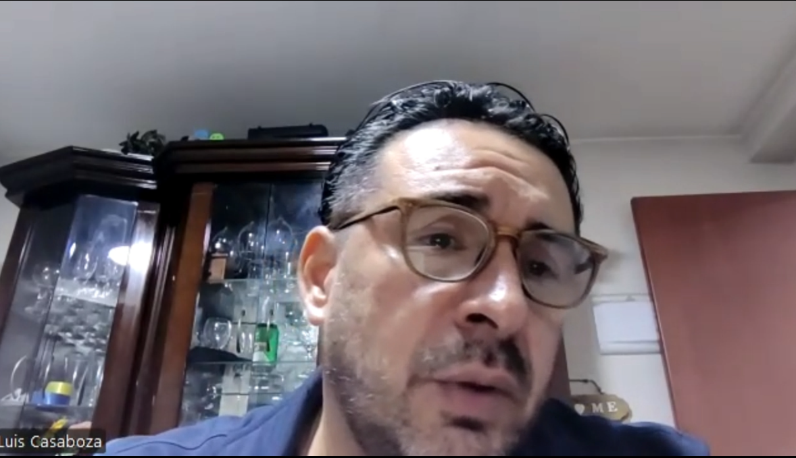

*Evidencia fotográfica: Registro de entrevista a profundidad con Luis Casaboza (Jefe de la Oficina de Tecnologías de la Información - SENASA).*

* **Acerca de la entrevista:**
  * **Link:** TraceHelp 202620 - Entrevistas.mp4
  * **Instante en el que inicia:** 0:00
  * **Duración:** 6:18
* **Síntesis del perfil:**  
  Luis lidera la mesa de ayuda a nivel nacional en el sector público. Desde una perspectiva objetiva, su principal desafío operativo es la dispersión geográfica de las sedes y la gran disparidad en las habilidades digitales de los usuarios, lo que satura su departamento con pedidos básicos (Nivel 1) y retrasa proyectos de infraestructura. A nivel tecnológico, su ecosistema de interacción se basa en un entorno de escritorio (navegadores web corporativos) utilizando GLPI, Jira, Microsoft Teams y AnyDesk. En cuanto a su personalidad, Luis presenta un perfil fuertemente estructurado, burocrático y adverso al riesgo, altamente influenciado por las normativas de seguridad digital del Estado (PCM y Ley de Protección de Datos). Subjetivamente, muestra un nivel de preocupación "muy alto" frente a la Inteligencia Artificial, temiendo que una fuga de datos o una respuesta inventada frene trámites legales o exportaciones agrícolas. Exige garantías de cifrado extremo a extremo, integración con Active Directory y el compromiso de no entrenar modelos públicos. Este hallazgo es fundamental para el arquetipo del líder estratégico gubernamental, ya que demuestra que prioriza la seguridad y exige modelos de licenciamiento de costos fijos anuales predecibles, rechazando categóricamente los esquemas que cobran por ticket resuelto debido a las restricciones presupuestales del sector público.

##### Entrevistado N.º 2: Valeria Portugal
* **Edad:** 52
* **Departamento/Distrito:** Lima (San Borja)
* **Estado civil:** Casada
* **Ocupación:** Jefe de Informática (Área TIC) en ELECTROPERU S.A.

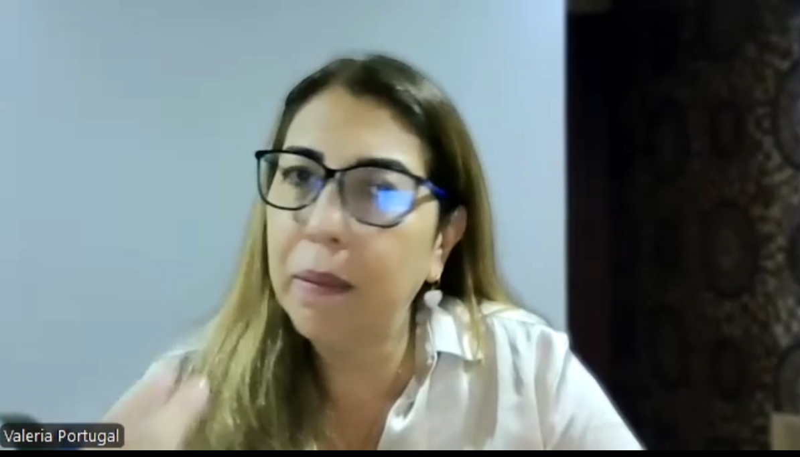

*Evidencia fotográfica: Registro de entrevista a profundidad con Valeria Portugal (Jefe de Informática - ELECTROPERU S.A.).*

* **Acerca de la entrevista:**
  * **Link:** TraceHelp 202620 - Entrevistas.mp4
  * **Instante en el que inicia:** 6:18
  * **Duración:** 8:54
* **Síntesis del perfil:**  
  Valeria gestiona la infraestructura tecnológica de una empresa estatal crítica de generación de energía. Su enfoque es netamente analítico y orientado al valor del negocio, evaluando el éxito del Helpdesk mediante el monitoreo estricto de KPIs como el MTTR, SLA, satisfacción del usuario y resolución en el primer contacto. Objetivamente, identifica que destinar personal altamente calificado a resolver consultas recurrentes (contraseñas, accesos) representa un uso poco eficiente de los recursos económicos y frena iniciativas de ciberseguridad. Tecnológicamente, es una usuaria avanzada de plataformas corporativas de ITSM y Teams, operando principalmente desde laptops corporativas. Desde el punto de vista subjetivo y de personalidad, Valeria es una líder corporativa cautelosa, pero con clara visión de innovación (ya ha evaluado chatbots y analítica predictiva). Su mayor temor es comprometer la continuidad del negocio por decisiones equivocadas derivadas de "alucinaciones" de la IA. Por ello, exige que cualquier proveedor cumpla con estándares internacionales (ISO 27001, ISO 27017, ISO 27701) y garantice trazabilidad completa. Este perfil consolida la necesidad de posicionar a TraceHelp como una solución transparente, donde el modelo de negocio favorezca la automatización a largo plazo (ROI a 3-5 años) sin penalizar el crecimiento de la demanda.

##### Entrevistado N.º 3: Alfonso Diaz
* **Edad:** 38
* **Departamento/Distrito:** Lima (Miraflores)
* **Estado civil:** Soltero
* **Ocupación:** Jefe de Operaciones y Soporte Técnico TI (Empresa de Facturación Electrónica)

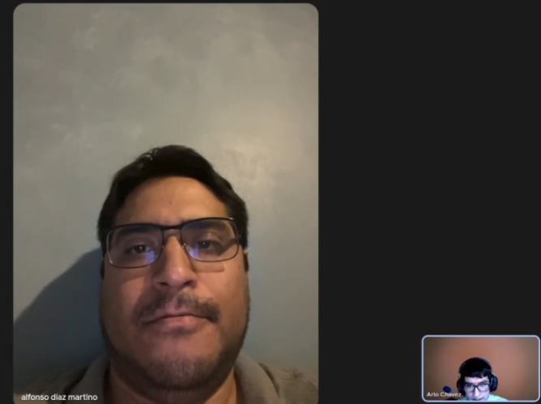

*Evidencia fotográfica: Registro de entrevista a profundidad con Alfonso Diaz (Jefe de Operaciones y Soporte Técnico TI).*

* **Acerca de la entrevista:**
  * **Link:** TraceHelp 202620 - Entrevistas.mp4
  * **Instante en el que inicia:** 15:12
  * **Duración:** 9:28
* **Síntesis del perfil:**  
  Alfonso trabaja en un entorno tecnológico de alto dinamismo, especializado en soluciones tributarias. Objetivamente, su ecosistema de atención es más ágil y omnicanal: el canal principal de entrada es WhatsApp Business (integrado con un bot básico), mientras que la gestión interna se apoya en un Helpdesk web y tableros de Trello, interactuando constantemente tanto desde dispositivos móviles (smartphones) como desde navegadores web (Chrome/Edge). Subjetivamente, Alfonso experimenta altos niveles de estrés durante los "días de cierre" (fin de mes), cuando el volumen de consultas repetitivas hace colapsar la bandeja, obligándolo a él mismo a contestar mensajes básicos. Su personalidad es pragmática y directa, buscando soluciones que alivien el esfuerzo mecánico. Tiene una profunda desconfianza hacia la IA genérica, sabiendo que un procedimiento fiscal equivocado generaría multas de SUNAT para sus clientes. Exige Acuerdos de Confidencialidad (NDA) estrictos y un historial auditable de las fuentes consultadas. Este perfil define una característica vital para el arquetipo: la herramienta solo será adoptada si la arquitectura RAG garantiza un 100% de exactitud en lectura de manuales e imágenes de error, prefiriendo tarifas fijas mensuales en lugar de esquemas que castiguen el crecimiento operativo.

---

#### Segmento Objetivo #2: Analistas y Especialistas de Soporte de TI (Operadores de Helpdesk Nivel 1 y 2)

##### Entrevistado N.º 1: Carlos Reategui
* **Edad:** 27
* **Departamento/Distrito:** Lima (Lince)
* **Estado civil:** Soltero
* **Ocupación:** Especialista de Infraestructura y Soporte (L2)

*Evidencia fotográfica: Registro de entrevista a profundidad con Carlos Reategui (Especialista de Infraestructura y Soporte L2).*

* **Acerca de la entrevista:**
  * **Link:** TraceHelp 202620 - Entrevistas.mp4
  * **Instante en el que inicia:** 24:40
  * **Duración:** 6:40
* **Síntesis del perfil:**  
  Carlos es un especialista técnico de una empresa grande que recibe los casos escalados desde la primera línea de atención. Objetivamente, utiliza plataformas de tickets, Teams y herramientas de monitoreo, trabajando habitualmente en configuraciones de múltiples pantallas (monitores extendidos) debido a la cantidad de consolas que debe revisar. Un hallazgo crítico en su flujo de trabajo es que pierde entre 20 y 30 minutos buscando información en repositorios dispersos cuando enfrenta incidentes poco comunes. Tecnológicamente, valora mucho el envío de capturas de pantalla, pero señala que estas requieren tiempo de interpretación humana. Desde la dimensión subjetiva, experimenta frustración recurrente ante tickets ambiguos (el clásico reporte de "no funciona"), y siente la presión generada por la acumulación de casos derivados de otros equipos. Su personalidad es metódica, analítica y resolutiva. Frente a la implementación de IA, muestra una postura colaborativa pero prudente; le gustaría un copiloto que resuma el caso y sugiera soluciones, pero exige mantener una estricta supervisión manual antes de ejecutar cualquier acción que pueda impactar los sistemas corporativos. Para él, el diseño ideal de la interfaz (UI) debe evitar "abrir mil cosas", concentrando todo el historial y las recomendaciones en una vista unificada.

##### Entrevistado N.º 2: Piero Ramirez
* **Edad:** 25
* **Departamento/Distrito:** Lima (Surquillo)
* **Estado civil:** Soltero
* **Ocupación:** Analista de Soporte (L1)

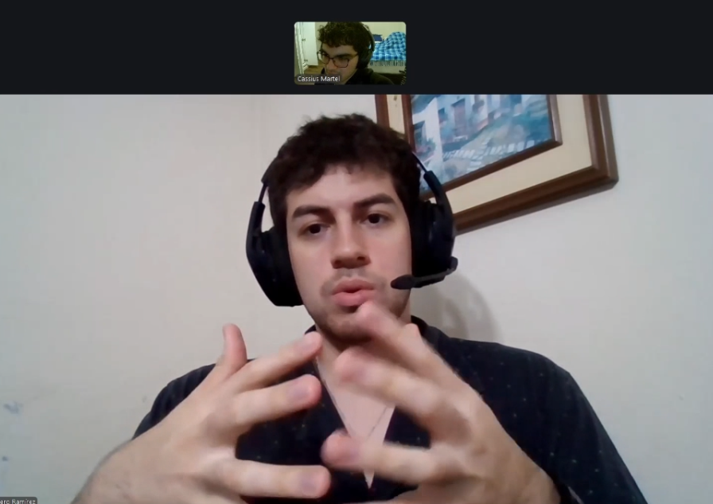

*Evidencia fotográfica: Registro de entrevista a profundidad con Piero Ramirez (Analista de Soporte TI L1).*

* **Acerca de la entrevista:**
  * **Link:** TraceHelp 202620 - Entrevistas.mp4
  * **Instante en el que inicia:** 31:20
  * **Duración:** 6:40
* **Síntesis del perfil:**  
  Piero representa la primera línea de contención en una empresa mediana/grande. Su rutina diaria es altamente repetitiva, invirtiendo cerca del 50% de su jornada laboral en gestionar problemas básicos (accesos, aplicativos caídos). Tecnológicamente, depende de bases de conocimiento internas, correo y Microsoft Teams. Objetivamente, su tiempo de diagnóstico se ve severamente penalizado (de 5 a 15 minutos extra) por las descripciones imprecisas de los usuarios y la necesidad de interpretar mensajes de error en capturas de pantalla aisladas. Subjetivamente, la constante entrada de tickets (backlog) le genera niveles de presión considerables, obligándolo a priorizar de forma manual y apresurada para evitar el colapso de la cola. Como nativo digital, está acostumbrado a interfaces ágiles, por lo que la documentación corporativa desactualizada le resulta un punto de dolor importante. Su expectativa respecto a la IA es pragmática: necesita que identifique, priorice y muestre soluciones citando la fuente exacta. Su perfil alimenta las características del arquetipo L1: un trabajador operativo que demanda una interfaz donde el contexto del usuario, la prioridad y la recomendación de la IA convivan en un panel intuitivo y de rápida acción.

##### Entrevistado N.º 3: Carlos Medina
* **Edad:** 25
* **Departamento/Distrito:** Lima (Surquillo)
* **Estado civil:** Soltero
* **Ocupación:** Analista de Soporte (L1)

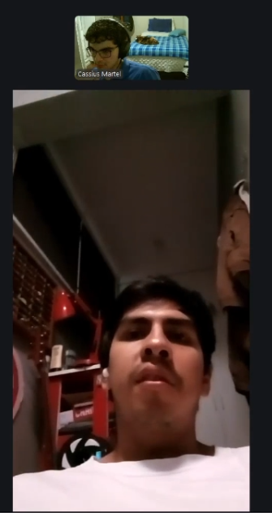

*Evidencia fotográfica: Registro de entrevista a profundidad con Carlos Medina (Analista de Soporte TI L1).*

* **Acerca de la entrevista:**
  * **Link:** TraceHelp 202620 - Entrevistas.mp4
  * **Instante en el que inicia:** 36:40
  * **Duración:** 7:48
* **Síntesis del perfil:**  
  Carlos opera en el exigente entorno de una empresa de retail con 1,200 colaboradores. Su ecosistema tecnológico es robusto e incluye herramientas como Jira Service Management, Microsoft Teams, Outlook, Active Directory y SharePoint, interactuando mayormente desde su estación de trabajo de escritorio. Objetivamente, inicia sus mañanas con colas de 30 a 40 tickets, dedicando entre el 60% y 70% de su día a tareas rutinarias (reseteo de claves). Un dato técnico clave es que recibe capturas de pantalla en el 70% u 80% de los casos, pero al ser borrosas, le exigen transcribir manualmente los códigos de error para buscar su significado. A nivel subjetivo, Carlos manifiesta niveles importantes de ansiedad y agotamiento mental, sintiendo que la operatividad constante ("apagar incendios") fragmenta su trabajo y frena su crecimiento profesional. Su personalidad es directa, orientada a la eficiencia y cansada del "ping-pong" de mensajes con usuarios ambiguos. En cuanto al diseño y adopción de TraceHelp, exige una experiencia de usuario limpia y directa. Valora la supervisión humana, buscando que la IA asuma la carga pesada de analizar las imágenes, permitiéndole a él validar la sugerencia en 5 segundos mediante botones de acción rápida ("Aprobar", "Escalar") para reducir los clics y acelerar la atención.

---

### 2.2.3. Análisis de entrevistas

#### Segmento Objetivo #1: Líderes Estratégicos de TI (CTOs, Gerentes y Jefes de Sistemas)
El primer segmento identificado corresponde a los tomadores de decisiones que lideran áreas de TI en sectores críticos (público, energético y facturación electrónica), donde la continuidad operativa es fundamental. De acuerdo con las entrevistas realizadas, se observa que el 100% de los sujetos lidia con la saturación de sus mesas de ayuda debido a tareas de baja complejidad. Desde una perspectiva objetiva y económica, el 100% de los líderes considera que destinar personal técnico calificado a resolver problemas repetitivos (como el restablecimiento de contraseñas o dudas frecuentes) representa un desperdicio de recursos económicos y genera cuellos de botella que retrasan la ejecución de proyectos estratégicos de mayor valor.

En cuanto al perfil de adopción tecnológica y modelos de negocio, el 100% de los entrevistados muestra un rechazo absoluto hacia los esquemas tradicionales de cobro de software ITSM que penalizan la automatización (cobro por ticket resuelto) o que exigen pagos adicionales por agente. Este hallazgo es fundamental para la construcción del arquetipo y para la estrategia comercial de TraceHelp, ya que los líderes buscan predecibilidad financiera mediante tarifas planas o costos fijos justificados por el ahorro en horas-hombre. Asimismo, el 100% de los participantes exige métricas claras de éxito para un periodo de prueba, esperando una reducción objetiva de al menos un 30% a 50% en la carga de tickets repetitivos de Nivel 1.

Desde una dimensión subjetiva y de gestión de riesgos, el segmento está profundamente marcado por la cautela frente a la Inteligencia Artificial. El 100% de los entrevistados manifiesta un nivel de preocupación "muy alto" respecto a la privacidad de los datos y el riesgo de "alucinaciones" (respuestas inventadas). El temor recae en que una respuesta inexacta de la IA pueda derivar en multas tributarias, frenar procesos legales o afectar la continuidad del negocio. En consecuencia, el 100% exige garantías estrictas de gobernanza, como certificaciones ISO (27001), auditoría de fuentes, no entrenamiento de modelos públicos y trazabilidad total de las respuestas. En conclusión, el arquetipo de este segmento se define por la búsqueda de eficiencia operativa y predecibilidad de costos, valorando soluciones de automatización que ofrezcan un control absoluto sobre la precisión de los datos y eliminen por completo la incertidumbre de la IA genérica.

#### Segmento Objetivo #2: Analistas y Especialistas de Soporte de TI (Operadores de Helpdesk Nivel 1 y 2)
El segundo segmento objetivo representa a la primera y segunda línea de defensa operativa, quienes interactúan directamente con la frustración del usuario y los cuellos de botella del sistema. El 100% de los entrevistados coincide en que las tareas repetitivas y operativas consumen una porción significativa de su jornada (llegando a ocupar entre el 50% y 70% del día en algunos casos). Objetivamente, el principal obstáculo identificado por el 100% de los sujetos es la ambigüedad en los reportes de los usuarios (tickets con descripciones como "no funciona" o "me sale un error"), lo que los obliga a iniciar un desgaste operativo en forma de preguntas y respuestas ("ping-pong") para poder realizar el triaje inicial.

En términos de diagnóstico visual y gestión del conocimiento, el análisis revela que el 100% de los analistas recibe capturas de pantalla de los errores con alta frecuencia. Sin embargo, estas imágenes a menudo carecen de contexto, obligándolos a invertir entre 5 y 30 minutos por incidente buceando en documentación interna (SharePoint, PDFs) o manuales desactualizados. Este dato valida objetivamente la necesidad de incorporar capacidades multimodales que no solo lean el texto, sino que interpreten la imagen del error y busquen automáticamente en la base de conocimiento de la empresa.

Desde la dimensión subjetiva, este segmento lidia con una carga emocional negativa ligada a la presión constante. El 100% de los analistas experimenta estrés, ansiedad o agotamiento debido a la acumulación de tickets en el backlog durante las horas punta. Subjetivamente, el 66.7% expresa una profunda frustración por sentirse atrapados en la operatividad, lo que les impide avanzar en proyectos de mejora profesional. Frente a la adopción de un copiloto inteligente, existe un consenso psicológico clave: el 100% exige un modelo de supervisión humana (Human-in-the-loop). Los analistas desean que la IA automatice la búsqueda y proponga el diagnóstico, pero exigen mantener el control para validar la acción final y revisar la fuente de la recomendación antes de ejecutarla. El arquetipo de este segmento se consolida como un usuario pragmático y sobrecargado, que demanda interfaces limpias y unificadas que reduzcan los clics, alivien la carga mental de la memorización de manuales y le devuelvan el tiempo para realizar labores técnicas más desafiantes.

---

## 2.3. Needfinding

### 2.3.1. User Personas

#### Segmento Objetivo #1: Líderes Estratégicos de TI (CTOs, Gerentes y Jefes de Sistemas)
Esta sección presenta la ficha arquetípica de **Roberto Pérez**, quien sintetiza el perfil del líder tecnológico corporativo enfocado en la gobernanza, cumplimiento de SLAs y optimización de costos en el helpdesk.

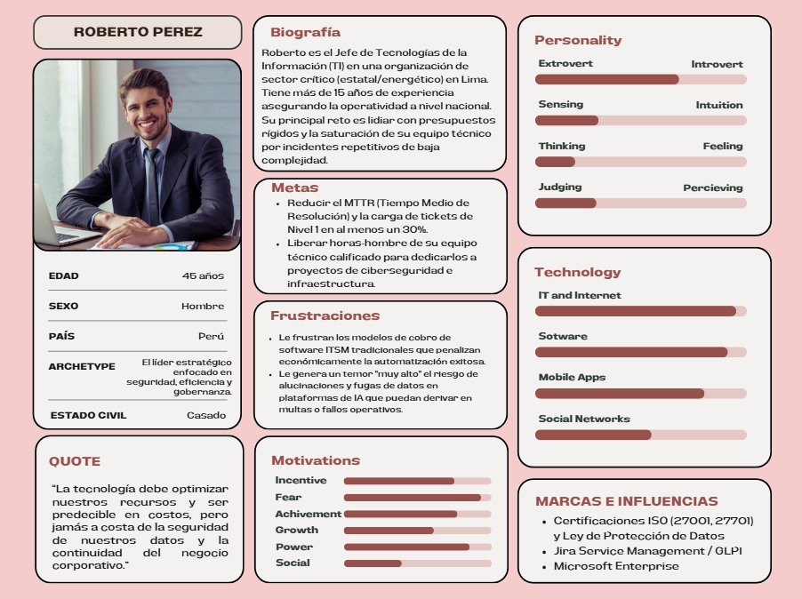

*Figura 2.* Ficha arquetípica de User Persona para Roberto Pérez (Líder Estratégico de TI), elaborada en UXPressia detallando demografía, metas de gobernanza, puntos de dolor y tecnologías.

#### Segmento Objetivo #2: Analistas y Especialistas de Soporte de TI (Operadores de Helpdesk Nivel 1 y 2)
Esta sección presenta la ficha arquetípica de **Karim Ramírez**, operador de soporte técnico de primera línea que experimenta la sobrecarga operativa, el tecnoestrés y la necesidad de herramientas de triaje inteligente asistidas por IA multimodal.

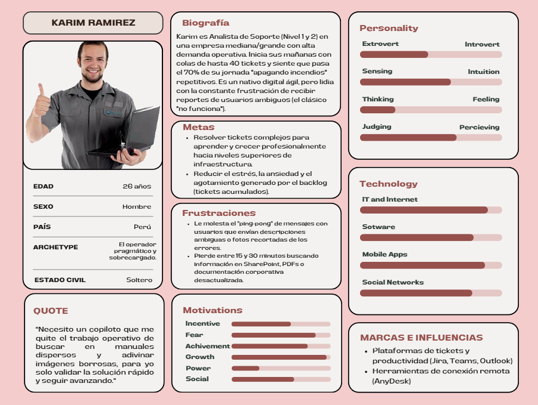

*Figura 3.* Ficha arquetípica de User Persona para Karim Ramírez (Analista de Soporte Helpdesk L1/L2), elaborada en UXPressia detallando demografía, sobrecarga operativa, tecnoestrés y herramientas de soporte.

---

### 2.3.2. User Task Matrix

La presente sección presenta el **User Task Matrix**, considerando los dos segmentos definidos para el proyecto: los Líderes Estratégicos de TI y los Analistas y Especialistas de Soporte de TI. A partir de las fichas de User Personas, se han identificado las tareas operativas y estratégicas clave que estos usuarios realizan en su día a día para cumplir con sus objetivos, independientemente de la existencia de la solución de software TraceHelp. Este análisis permite comprender la frecuencia e importancia de cada actividad, sirviendo como base para entender dónde se concentran los cuellos de botella y priorizar el desarrollo del sistema.

| User Task Matrix | Roberto Pérez (Líder Estratégico de TI) - Frecuencia | Roberto Pérez (Líder Estratégico de TI) - Importancia | Karim Ramírez (Analista de Soporte TI L1) - Frecuencia | Karim Ramírez (Analista de Soporte TI L1) - Importancia |
| :--- | :---: | :---: | :---: | :---: |
| **Monitorear indicadores de rendimiento (MTTR, SLA y volumen de tickets)** | Siempre | Alta | Con frecuencia | Media |
| **Supervisar costos operativos y justificar retorno de inversión (ROI) del Helpdesk** | Con frecuencia | Alta | Rara vez | Baja |
| **Auditar cumplimiento de políticas de seguridad y gobernanza de datos (ISO 27001)** | Con frecuencia | Alta | Ocasionalmente | Media |
| **Gestionar y actualizar manuales técnicos y bases de conocimiento corporativas** | Ocasionalmente | Media | Con frecuencia | Alta |
| **Recepción, clasificación y triaje inicial de solicitudes de soporte L1** | Nunca | Baja | Siempre | Alta |
| **Interpretación y diagnóstico de capturas de pantalla de errores** | Nunca | Baja | Siempre | Alta |
| **Búsqueda de procedimientos de solución en manuales dispersos (PDFs/SharePoint)** | Rara vez | Baja | Siempre | Alta |
| **Interacción y comunicación repetitiva con usuarios por reportes ambiguos ("ping-pong")** | Nunca | Baja | Siempre | Alta |
| **Resolución de incidentes rutinarios de Nivel 1 (reseteo de credenciales, accesos básicos)** | Nunca | Baja | Siempre | Alta |
| **Escalamiento y derivación de incidentes complejos a especialistas de Nivel 2 y 3** | Ocasionalmente | Media | Con frecuencia | Alta |

---

### 2.3.3. Empathy Mapping

En esta sección, el equipo resume el proceso de empatización y presenta los Empathy Maps elaborados para cada una de nuestras User Personas clave: Roberto Pérez (Líder Estratégico de TI) y Karim Ramírez (Analista de Soporte L1/L2).

Esta sección presenta el Empathy Map elaborado para **Roberto Pérez**, nuestra User Persona representativa de los Líderes Estratégicos de TI (CTOs, Gerentes y Jefes de Sistemas). El mapa sintetiza las presiones de gobernanza, presupuesto y ciberseguridad a las que se enfrenta al gestionar el soporte técnico corporativo.

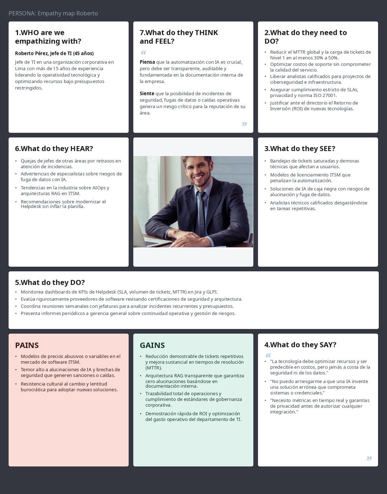

*Figura 4.* Mapa de Empatía (Empathy Map) de Roberto Pérez elaborado en UXPressia, sintetizando lo que piensa, siente, ve, oye, dice y hace respecto al rendimiento del Helpdesk corporativo.

Esta sección presenta el Empathy Map elaborado para **Karim Ramírez**, nuestro User Persona que representa a los Analistas de Soporte de Nivel 1 y 2. El mapa refleja la sobrecarga cognitiva, el tecnoestrés y la frustración que experimenta en la atención diaria de tickets no estructurados.

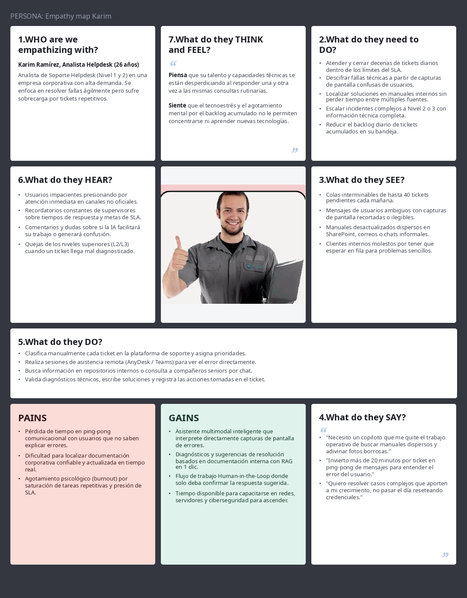

*Figura 5.* Mapa de Empatía (Empathy Map) de Karim Ramírez elaborado en UXPressia, sintetizando su experiencia emocional frente a incidentes ambiguos, esfuerzo de diagnóstico y presión por SLAs.

---

### 2.3.4. As-is Scenario Mapping

#### Segmento 1: Líderes Estratégicos de TI (Roberto Pérez)
El siguiente escenario As-Is fue desarrollado a partir de entrevistas y análisis del comportamiento del perfil de Roberto Pérez. Se identificaron las principales fases que conforman su rutina de supervisión estratégica, monitoreo de métricas operativas y gestión presupuestal del área de TI sin contar con TraceHelp.

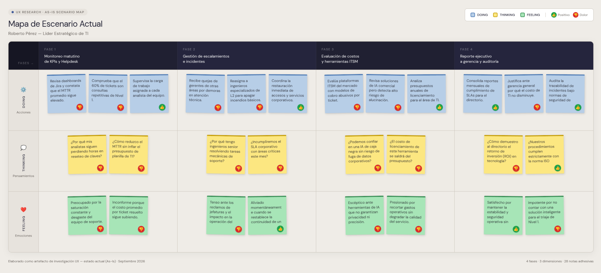

*Figura 6.* As-Is Scenario Mapping para Roberto Pérez (Líder Estratégico de TI), ilustrando las fases actuales de supervisión, detección de cuellos de botella, estrés operativo y justificación de costos sin TraceHelp.

#### Segmento 2: Analistas y Especialistas de Soporte de TI (Karim Ramírez)
El siguiente escenario As-Is fue desarrollado a partir de entrevistas y análisis del comportamiento del perfil de Karim Ramírez. Se identificaron las principales fases que conforman su flujo de trabajo diario actual como analista de soporte técnico, evidenciando las tareas manuales, la falta de información contextual y el tecnoestrés derivado de la atención de tickets repetitivos sin TraceHelp.

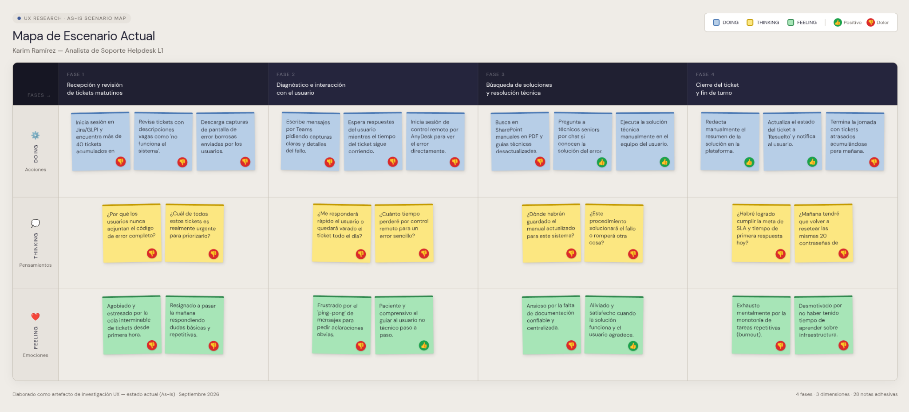

*Figura 7.* As-Is Scenario Mapping para Karim Ramírez (Analista de Soporte TI L1), ilustrando las fases operativas de recepción de tickets, interpretación manual de errores en imágenes, tecnoestrés y resolución sin TraceHelp.

---

## 2.4. Ubiquitous Language

En esta sección se presentan los términos clave del proyecto **TraceHelp**. Estos términos han sido evaluados por el equipo y definen el lenguaje del dominio de gestión de servicios de TI, el cual es asistido por inteligencia artificial y arquitecturas RAG. Serán utilizados de manera consistente en la comunicación, especificación de requerimientos, modelado estratégico de Domain-Driven Design (DDD) y desarrollo de los distintos componentes del sistema.

### Glosario de Dominio (Ubiquitous Language)

| Term (EN) | Definición (ES) |
| :--- | :--- |
| **Incident / Ticket (Incidente / Ticket)** | Registro formal de una interrupción no planificada, degradación de un servicio de TI o consulta técnica reportada por un colaborador de la organización. |
| **Ticket Triage (Triaje de tickets)** | Proceso de evaluación inicial que analiza el contenido de un incidente para determinar automáticamente su categoría, criticidad, severidad y canal de asignación adecuado. |
| **Multimodal Input (Entrada multimodal)** | Capacidad del sistema para recibir y procesar conjuntamente texto descriptivo e imágenes (capturas de pantalla de errores, mensajes del sistema operativo o diálogos de software). |
| **Visual Error Diagnosis (Diagnóstico visual de errores)** | Proceso de extracción e interpretación semántica mediante visión artificial (OCR y modelos multimodales) para identificar códigos de fallo, ventanas emergentes y anomalías gráficas. |
| **Knowledge Base / KB (Base de conocimiento)** | Repositorio corporativo centralizado que contiene artículos técnicos, manuales operativos, guías de soporte y soluciones a problemas conocidos validados por el área de TI. |
| **Knowledge Chunk (Fragmento de conocimiento)** | Bloque de texto normalizado y tokenizado extraído de la documentación corporativa, optimizado para indexación y búsqueda vectorial eficiente. |
| **Vector Embedding (Incrustación vectorial)** | Representación numérica de alta dimensionalidad de un fragmento de texto o consulta, que permite calcular similitudes semánticas en una base de datos vectorial. |
| **Retrieval-Augmented Generation / RAG (Generación Aumentada por Recuperación)** | Patrón arquitectónico que recupera fragmentos pertinentes de la base de conocimiento corporativa y los suministra como contexto a un LLM para generar respuestas fundamentadas y precisas. |
| **Grounding (Fundamentación de respuestas)** | Principio arquitectónico que obliga al asistente inteligente a basar sus respuestas y recomendaciones exclusivamente en las fuentes oficiales verificadas de la empresa. |
| **Hallucination (Alucinación)** | Generación de respuestas plausibles pero erróneas o no sustentadas por parte del modelo de lenguaje; riesgo mitigado en el sistema mediante la arquitectura RAG y el grounding estricto. |
| **Human-in-the-Loop / HITL (Supervisión humana en el flujo)** | Modelo operativo donde la IA propone un diagnóstico y una respuesta sugerida, pero un analista de soporte humano debe revisar y confirmar antes de ejecutarla o enviarla. |
| **Suggested Resolution (Resolución sugerida)** | Propuesta estructurada generada por TraceHelp que incluye pasos técnicos de solución, diagnósticos previos y enlaces a las fuentes oficiales de la documentación utilizada. |
| **Confidence Score (Puntaje de confianza)** | Valor numérico probabilístico asignado por el motor de triaje que indica el grado de certeza y correspondencia semántica entre el incidente reportado y el conocimiento recuperado. |
| **Ticket Deflection (Deflexión de tickets)** | Resolución exitosa de un incidente mediante autoservicio o recomendación automatizada de primer contacto, evitando la intervención prolongada o el escalamiento a niveles superiores. |
| **Escalation (Escalamiento)** | Transferencia formal y automatizada de un incidente hacia analistas de Soporte Nivel 2 (L2) o Especialistas Nivel 3 (L3) cuando su complejidad o permisos exceden el alcance del Nivel 1. |
| **Mean Time to Resolve / MTTR (Tiempo medio de resolución)** | Métrica estándar de ITSM que contabiliza el tiempo promedio transcurrido desde que un usuario registra un ticket hasta que la solución es aplicada y confirmada. |
| **First Contact Resolution / FCR (Resolución en primer contacto)** | Porcentaje de tickets que logran ser solucionados durante la primera interacción con el soporte, sin requerir reasignaciones ni comunicaciones adicionales. |
| **Service Level Agreement / SLA (Acuerdo de nivel de servicio)** | Compromiso formal que estipula los tiempos máximos permitidos para la primera respuesta y para la resolución definitiva de un incidente según su nivel de prioridad. |
| **Support Analyst L1 (Analista de soporte Nivel 1)** | Operador de la mesa de ayuda responsable de la recepción de solicitudes, atención inicial, diagnóstico guiado y aplicación de soluciones rutinarias de helpdesk. |
| **Support Specialist L2/L3 (Especialista de soporte Nivel 2/3)** | Ingeniero técnico de infraestructura, redes o desarrollo encargado de resolver incidencias complejas, caídas de servidores o fallas críticas que requieren permisos elevados. |
| **ITSM Platform (Plataforma de gestión de servicios de TI)** | Sistema empresarial de gestión de tickets y mesa de ayuda (ej. Jira Service Management, ServiceNow, GLPI) con el cual se integra TraceHelp. |
| **Audit Trail / Activity Log (Registro de auditoría / Trazabilidad)** | Bitácora inmutable que almacena cronológicamente cada acción realizada en el ticket: consultas recibidas, fragmentos RAG consultados, sugerencias emitidas y usuario que validó la acción. |
| **Data Masking / PII Protection (Enmascaramiento de datos sensibles / PII)** | Filtro de seguridad que anonimiza contraseñas, tokens y datos personales en tickets y capturas de pantalla antes de que sean procesados por el modelo de lenguaje. |

