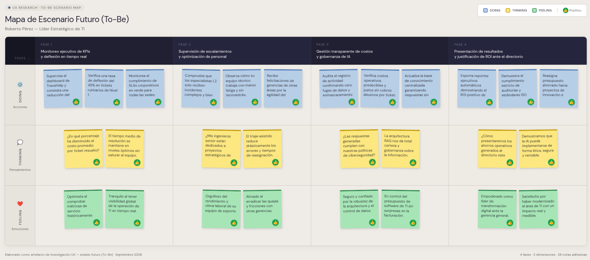
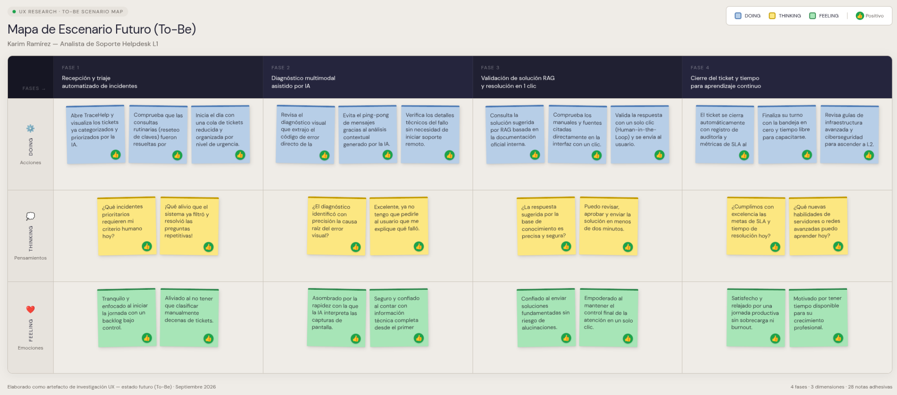

# Capítulo III: Requirements Specification

## 3.1. To-Be Scenario Mapping

### Segmento Objetivo 1: Líderes Estratégicos de TI (CTOs, Gerentes y Jefes de Sistemas)

Este escenario To-Be fue construido a partir del análisis del escenario As-Is de Roberto Pérez. Se proyectó una experiencia futura donde el líder de TI cuenta con TraceHelp para optimizar la gobernanza, controlar el presupuesto de soporte y reducir el MTTR en más del 40%. La solución asegura trazabilidad inalterable, confidencialidad bajo estándares ISO 27001 y justificación tangible del retorno de inversión (ROI) ante la alta dirección.

*Figura 8.* To-Be Scenario Mapping para Roberto Pérez (Líder Estratégico de TI), proyectando la optimización de gobernanza, control de presupuesto de soporte y analítica de ROI mediante TraceHelp.

### Segmento 2: Analistas y Especialistas de Soporte de TI (Helpdesk L1 y L2)

Este escenario To-Be fue construido tras una revisión del escenario As-Is de Karim Ramírez y de las oportunidades de mejora identificadas en las entrevistas. Se redefinieron las fases del proceso de atención técnica incorporando las capacidades de triaje multimodal y asistencia basada en RAG de TraceHelp. Se priorizaron mejoras en velocidad de diagnóstico, precisión fundamentada en documentación oficial, eliminación del tecnoestrés y empoderamiento del analista mediante un flujo asistido de validación en un solo clic.

*Figura 9.* To-Be Scenario Mapping para Karim Ramírez (Analista de Soporte TI L1/L2), proyectando la agilización del triaje con IA multimodal, eliminación del tecnoestrés y validación de resoluciones en un solo clic.

---
