# 4. Capítulo IV: Strategic-Level Software Design

## 4.1. Strategic-Level Attribute-Driven Design

El proceso de diseño guiado por atributos (Attribute-Driven Design - ADD), desarrollado por el Software Engineering Institute (SEI), es el método sistemático utilizado para establecer la arquitectura de software de TraceHelp. En este enfoque, los atributos de calidad junto con las restricciones técnicas actúan como los principales impulsadores (architectural drivers) que determinan la descomposición funcional, los patrones y las tácticas arquitectónicas de la solución.

Como solución basada en productos y tecnologías de Transformación Digital, TraceHelp requiere un diseño intencional donde los requisitos no funcionales, rendimiento, disponibilidad, seguridad, confidencialidad y precisión diagnóstica, tengan un peso decisivo sobre las elecciones de patrones, tácticas e infraestructura. A través del proceso ADD, se asegura que las decisiones arquitectónicas mitiguen riesgos técnicos de forma temprana y garanticen la escalabilidad operativa de la mesa de ayuda corporativa.

### 4.1.1. Design Purpose

El propósito del proceso de diseño arquitectónico de TraceHelp es definir una estructura de software distribuida, modular, escalable y altamente segura que resuelva la problemática central del soporte técnico corporativo: el elevado Tiempo Medio de Resolución (MTTR) y el burnout analítico provocado por el triaje manual repetitivo de incidentes de TI.

El diseño satisface de manera directa las necesidades de los dos segmentos objetivo del negocio:

- **Líderes Estratégicos de TI:** Requieren una plataforma con un alto retorno de inversión (ROI), gobernanza de datos estricta (cumplimiento ISO 27001), trazabilidad inalterable de auditoría y tableros analíticos en tiempo real sobre la productividad de la mesa de ayuda.
- **Analistas de Soporte Nivel 1 y Colaboradores No Técnicos:** Exigen respuestas diagnósticas precisas fundamentadas exclusivamente en la documentación oficial de la empresa (cero alucinaciones), capacidad de procesar imágenes y capturas de pantalla de errores (multimodalidad) y un flujo operativo de validación humana (Human-in-the-Loop - HITL) para garantizar la calidad del servicio expedido.

### 4.1.2. Attribute-Driven Design Inputs

El proceso de diseño ADD requiere la definición clara y rigurosa de sus inputs primarios. Estos insumos alimentan las iteraciones de diseño e identifican las fuerzas que modelarán la arquitectura. Los inputs se clasifican en tres categorías fundamentales: la funcionalidad primaria con mayor impacto estructural, los escenarios concretos de atributos de calidad y las restricciones técnicas no negociables del entorno.

#### 4.1.2.1. Primary Functionality (Primary User Stories)

En esta sección se especifican las Historias de Usuario (User Stories) e Historias Técnicas (Technical Stories) primarias que poseen la mayor relevancia en términos de requisitos funcionales y que ejercen un impacto directo sobre la arquitectura de software de TraceHelp. Los requisitos seleccionados se resumen en cuatro flujos críticos para el sistema:

- **Ingesta y vectorización asíncrona:** Capacidad del sistema para recibir manuales corporativos (PDF/Markdown) y procesarlos en segundo plano para alimentar el motor de IA.
- **Triaje y análisis multimodal:** Funcionalidad que permite a los usuarios reportar incidentes adjuntando imágenes, requiriendo que el sistema extraiga texto de códigos de error mediante OCR.
- **Diagnóstico asistido por RAG:** El núcleo inteligente que garantiza que las soluciones propuestas estén estrictamente fundamentadas en la base de conocimiento interna, incluyendo citas bibliográficas exactas.
- **Validación humana (Human-in-the-Loop):** El mecanismo de control que permite a los analistas L1 revisar, editar y aprobar las respuestas de la IA antes de su envío final al usuario.

A continuación, se detallan estos requisitos funcionales y técnicos de alto impacto:

| Epic / User Story ID | Título | Descripción | Criterios de Aceptación | Relacionado con (Epic ID) |
| :--- | :--- | :--- | :--- | :--- |
| **US06** | Carga e Ingesta de Documentos Técnicos Corporativos | Como Líder Estratégico de TI, deseo subir manuales operativos y guías en formato PDF o Markdown al workspace corporativo, para alimentar la base de conocimiento del motor RAG. | Escenario 1: Ingesta exitosa de manuales PDF o Markdown. Dado que el Líder de TI adjunta un archivo PDF o Markdown válido en el workspace, Cuando confirma la carga del documento, Entonces el sistema fragmenta el texto en chunks, genera las incrustaciones vectoriales y confirma la disponibilidad del conocimiento. Escenario 2: Rechazo por superación de tamaño o extensión no permitida. Dado que el usuario intenta subir un archivo con formato no soportado, Cuando presiona el botón de carga, Entonces el sistema detiene la operación y emite una alerta con las extensiones aceptadas. | **EP02** |
| **US10** | Reporte de Incidente mediante Análisis Multimodal de Capturas | Como Colaborador no técnico, deseo adjuntar una imagen del mensaje de error informático que aparece en mi equipo, para recibir una solución sin transcribir manualmente el código de falla. | Escenario 1: Diagnóstico exitoso mediante imagen de error. Dado que el colaborador adjunta una captura en formato PNG o JPG con un código de falla legible, Cuando envía la consulta a TraceHelp, Entonces el motor multimodal extrae el texto mediante OCR, consulta la base RAG y entrega la explicación de la falla. Escenario 2: Captura ilegible o sin texto detectado. Dado que el usuario sube una imagen borrosa o sin caracteres de error, Cuando el sistema procesa la imagen, Entonces emite una alerta pidiendo una captura de mejor calidad o una descripción textual adicional. | **EP03** |
| **US11** | Consulta Asistida por RAG con Citas de Documentos Oficiales | Como Analista de Soporte Nivel 1, deseo obtener una propuesta de diagnóstico generada por el motor RAG que incluya las citas bibliográficas internas de la empresa, para respaldar técnicamente la atención del ticket. | Escenario 1: Generación de solución respaldada con fuentes exactas. Dado que un analista Nivel 1 consulta una falla sobre un ticket asignado, Cuando solicita la sugerencia del asistente, Entonces el motor RAG sintetiza la respuesta basándose en los manuales internos e incluye las citas con nombre de archivo y número de párrafo. Escenario 2: Búsqueda con información insuficiente en la base RAG. Dado que la consulta no encuentra coincidencias con un score de similitud aceptable en la base del workspace, Cuando el motor procesa la petición, Entonces notifica que no posee evidencias suficientes y sugiere transferir el caso. | **EP03** |
| **US15** | Validación Humana de Soluciones Sugeridas (HITL) | Como Analista de Soporte Nivel 1, deseo revisar, editar o aprobar la respuesta generada por la IA antes de enviarla al colaborador, para asegurar la precisión del mensaje expedido. | Escenario 1: Aprobación directa de la propuesta de la IA. Dado que la IA presenta un borrador de respuesta preciso para un ticket, Cuando el analista aprueba la recomendación, Entonces el sistema despacha el mensaje al usuario final y marca la solución como validada por humano. Escenario 2: Edición y corrección de la respuesta antes del envío. Dado que el borrador sugerido requiere ajustes técnicos, Cuando el analista edita el texto y confirma el envío, Entonces el sistema entrega la versión corregida al colaborador y almacena la modificación como retroalimentación. | **EP04** |
| **TS01** | Endpoint RESTful para Ingesta y Vectorización de Documentos | Como Developer, deseo disponer de la API RESTful POST /api/v1/workspaces/{id}/documents para procesar archivos técnicos e indexarlos, para integrar el almacenamiento con el pipeline RAG. | Escenario 1: Ingesta asíncrona aceptada (HTTP 202). Dado que el desarrollador envía POST /api/v1/workspaces/ws-01/documents con un archivo PDF o Markdown válido, Cuando la API autentica la petición y valida la estructura, Entonces responde con 202 Accepted entregando un objeto JSON con el jobId del procesamiento. Escenario 2: Formato de archivo no soportado (HTTP 400). Dado que la petición contiene un archivo con extensión no permitida, Cuando la API ejecuta las validaciones de entrada, Entonces responde con 400 Bad Request. | **EP06** |
| **TS02** | Endpoint RESTful para Consultas Diagnósticas RAG Multimodales | Como Developer, deseo consumir el servicio RESTful POST /api/v1/triage/analyze enviando texto e imagen en formato multipart, para obtener la recomendación estructurada de solución. | Escenario 1: Diagnóstico generado exitosamente (HTTP 200). Dado que la aplicación cliente envía POST /api/v1/triage/analyze con datos válidos, Cuando el backend ejecuta la extracción multimodal y la búsqueda vectorial, Entonces responde con 200 OK retornando el diagnóstico, la lista de citas y el score de confianza. Escenario 2: Solicitud mal formada sin datos obligatorios (HTTP 400). Dado que la petición carece del parámetro workspaceId o del cuerpo de consulta, Cuando la API valida la entrada, Entonces responde con 400 Bad Request. | **EP06** |

#### 4.1.2.2. Quality Attribute Scenarios

Los escenarios de atributos de calidad caracterizan las metas no funcionales del sistema en términos cuantitativos y comprobables, sirviendo como insumo principal para el proceso de diseño arquitectónico. Para la primera versión de la arquitectura de TraceHelp, se han identificado cinco atributos de calidad con mayor impacto en la solución:

- **Rendimiento (Performance):** Para asegurar tiempos de respuesta ágiles (menores a 3.5 segundos) durante el complejo análisis multimodal y vectorial.
- **Disponibilidad (Availability):** Para garantizar la continuidad operativa de la mesa de ayuda ante fallos de infraestructura mediante mecanismos de failover.
- **Seguridad y Privacidad (Security):** Enfocado en la anonimización obligatoria de datos sensibles (PII) antes de invocar modelos LLM externos.
- **Fiabilidad (Reliability/Accuracy):** Crítico para mitigar el 100% de las alucinaciones del motor IA, fundamentando cada respuesta mediante la arquitectura RAG.
- **Escalabilidad (Scalability):** Para soportar la ingesta y vectorización masiva de manuales técnicos en segundo plano sin degradar el servicio principal.

A continuación, se detalla el cuadro donde cada escenario especifica el origen del estímulo, la condición desencadenante, el artefacto afectado, el entorno operativo, la respuesta esperada y su respectiva métrica de medición:

| Atributo | Fuente | Estímulo | Artefacto | Entorno | Respuesta | Medida |
| :--- | :--- | :--- | :--- | :--- | :--- | :--- |
| **Performance (Rendimiento)** | Analista L1 / Colaborador no técnico | Envío de una consulta de soporte compuesta por texto y captura de pantalla de error (solicitud multimodal). | Servicio Backend de Triaje Multimodal (POST /api/v1/triage/analyze) | Carga habitual de trabajo con 100 solicitudes concurrentes en hora pico. | El sistema procesa la imagen mediante visión artificial (OCR), ejecuta la búsqueda vectorial en el workspace y genera el diagnóstico citado. | Tiempo total de respuesta T <= 3.5 segundos para el percentil 95. |
| **Availability (Disponibilidad)** | Infraestructura Cloud / Red | Falla imprevista o caída de un nodo activo en el microservicio de triaje. | Cluster de Microservicios Backend / Load Balancer | Operación continua 24/7 en producción. | El balanceador de carga redirige el tráfico de forma transparente hacia los nodos secundarios (failover automático) y registra el evento de infraestructura. | Tiempo de recuperación de servicio Tdown <= 15 segundos sin pérdida de peticiones en tránsito (Disponibilidad >= 99%). |
| **Security (Seguridad / Privacidad)** | Colaborador no técnico | Envío de un ticket de soporte que contiene credenciales explícitas, tokens o datos personales (PII) en la captura o texto. | API Gateway / Módulo de Anonimización y Seguridad PII | Operación normal antes de enviar el prompt al motor de IA externo. | El módulo de seguridad intercepta la petición, identifica patrones PII mediante Regex y NER, y sustituye los datos por etiquetas neutras anonimizadas. | 100% de datos sensibles (PII) anonimizados antes de que la consulta salga del perímetro de red del backend. |
| **Reliability / Accuracy (Fiabilidad RAG)** | Motor de Búsqueda Vectorial | Recepción de una consulta sobre una falla técnica que no existe en los manuales del workspace corporativo. | Engine de Inferencia RAG | Operación regular en producción. | El sistema evalúa el score de similitud vectorial y, al resultar inferior al umbral ($score < 0.70$), rehúsa responder especulativamente y notifica falta de evidencia. | 0\% de respuestas alucinadas o no fundamentadas en la documentación cargada. |
| **Scalability (Escalabilidad)** | Líder Estratégico de TI | Carga masiva en paralelo de 50 manuales técnicos corporativos en formato PDF. | Servicio de Ingesta y Vectorización Asíncrona | Procesamiento en segundo plano (Background Job). | El sistema encola los archivos, distribuye el procesamiento de chunks mediante colas de mensajes y actualiza la base vectorial dinámicamente. | Ingesta completa y actualización del índice vectorial en T <= 120 segundos sin degradar las consultas activas. |

#### 4.1.2.3. Constraints

Las restricciones representan decisiones de diseño con cero grados de libertad impuestas por normativas legales, decisiones tecnológicas corporativas o especificaciones técnicas del proyecto. Para el desarrollo de la arquitectura de TraceHelp, los principales constraints a considerar se agrupan en tres áreas críticas:

- **Seguridad y Gobernanza:** Cumplimiento estricto de políticas corporativas y la norma ISO 27001, lo que obliga a implementar la anonimización de datos sensibles (PII) de forma local antes de cualquier interacción con modelos LLM externos, así como asegurar los endpoints mediante tokens JWT y control de acceso basado en roles (RBAC).
- **Infraestructura:** Despliegue obligatorio bajo un ecosistema Cloud-Native, exigiendo el empaquetamiento de todos los microservicios en contenedores (Docker/Kubernetes) para asegurar portabilidad y escalabilidad en la nube.
- **Estándares de Diseño API:** Obligatoriedad de estructurar todos los mensajes de error de las APIs RESTful bajo el formato estándar de la especificación RFC 7807 (Problem Details).

| Technical Story ID | Título | Descripción | Criterios de Aceptación | Relacionado con (Epic ID) |
| :--- | :--- | :--- | :--- | :--- |
| **TS03** | Restricción de Autenticación Corporativa mediante JWT y RBAC | Como Developer, deseo implementar el acceso a las APIs mediante Tokens JWT firmados y Control de Acceso Basado en Roles (RBAC), para restringir las operaciones backend únicamente a usuarios autorizados. | Escenario 1: Emisión de Token JWT firmado. Dado que un usuario envía credenciales válidas, Cuando el servicio valida la identidad, Entonces retorna un token JWT que incluye los roles del usuario. Escenario 2: Rechazo de acceso a API por token expirado (HTTP 401). Dado que un cliente realiza una petición con un JWT caducado, Cuando la API valida la firma, Entonces rechaza la solicitud con el código 401 Unauthorized. | **EP06** |
| **CON01** | Restricción de Respuestas de Error RESTful en Formato RFC 7807 | Como Developer, deseo estandarizar los mensajes de error en todas las APIs RESTful siguiendo la especificación RFC 7807 (Problem Details), para proveer respuestas estructuradas al cliente. | Escenario 1: Respuesta de validación estructurada según RFC 7807. Dado que una petición contiene datos inválidos, Cuando la API responde un error HTTP 400, Entonces incluye en el cuerpo JSON los campos type, title, status, detail e instance. | **EP06** |
| **CON02** | Restricción de Despliegue en Infraestructura Cloud-Native Containerizada | Como Developer, deseo empaquetar todos los microservicios backend y aplicaciones en contenedores Docker organizados con Docker Compose / Kubernetes, para garantizar la portabilidad y despliegue continuo en la nube. | Escenario 1: Construcción de imagen de contenedor inmutable. Dado que se actualiza el código fuente del backend, Cuando se ejecuta el pipeline de integración, Entonces se genera una imagen Docker etiquetada lista para despliegue sin dependencias del servidor host. | **EP06** |
| **CON03** | Restricción de Cumplimiento Normativo de Privacidad y Anonimización PII | Como Developer, deseo procesar el filtrado de PII dentro del perímetro interno de la arquitectura antes de la invocación de LLMs externos, para dar cumplimiento a la norma ISO 27001 y políticas corporativas. | Escenario 1: Intercepción y filtrado obligatorio pre-LLM. Dado que una consulta se envía al conector del LLM, Cuando pasa por la capa de integración, Entonces el sistema verifica que la cadena recibida cuente con el sello de auditoría de anonimización PII. | **EP03** |

### 4.1.3. Architectural Drivers Backlog

El Architectural Drivers Backlog consolida los requerimientos funcionales críticos, escenarios de calidad y restricciones negociadas durante las sesiones del Quality Attribute Workshop (QAW). La priorización está determinada por la combinación de dos criterios: la Importancia para los Stakeholders y el Impacto en la Complejidad Técnica de la Arquitectura. Colocando al inicio aquellos calificados como High-High.

| Driver ID | Título de Driver | Descripción | Importancia para Stakeholders (High, Medium, Low) | Impacto en Architecture Technical Complexity (High, Medium, Low) |
| :--- | :--- | :--- | :--- | :--- |
| **DRV-01** | Rendimiento en Triaje Multimodal RAG (QAS-01) | Garantizar un tiempo de respuesta T <= 3.5s (percentil 95) en peticiones que combinan procesamiento de imágenes OCR y búsqueda vectorial RAG. | High | High |
| **DRV-02** | Sanitización y Anonimización PII Pre-LLM (QAS-03 / CON-03) | Enmascarar al 100% los datos sensibles en texto e imágenes antes de la salida fuera del perímetro del backend corporativo. | High | High |
| **DRV-03** | Mitigación de Alucinaciones en el Engine RAG (QAS-04) | Garantizar que el 100% de respuestas estén fundamentadas exclusivamente en manuales oficiales del workspace (score >= 0.70). | High | High |
| **DRV-04** | Triaje Multimodal y Citas Bibliográficas (US10 / US11) | Capacidad funcional de extraer texto de capturas de pantalla y presentar citas con nombre de archivo y número de párrafo. | High | High |
| **DRV-05** | Flujo Operativo Human-in-the-Loop - HITL (US15) | Mecanismo de supervisión que permite a los analistas L1 revisar, editar o aprobar las soluciones propuestas por la IA antes del envío. | High | High |
| **DRV-06** | Disponibilidad Continua del Sistema (QAS-02) | Mantener una disponibilidad del 99.9% con un tiempo de recuperación por falla Tdown <= 15 segundos mediante failover. | High | Medium |
| **DRV-07** | Escalabilidad Asíncrona en Ingesta de Manuales (QAS-05 / US06) | Ingesta masiva y vectorización de documentos técnicos mediante procesamiento en segundo plano sin bloquear el sistema. | High | Medium |
| **DRV-08** | Despliegue Containerizado Cloud-Native (CON-02) | Empaquetamiento de servicios en contenedores Docker para garantizar escalabilidad horizontal en la nube. | High | Medium |
| **DRV-09** | Seguridad JWT / RBAC y Formato RFC 7807 (TS03 / CON-01) | Autenticación basada en tokens, control de acceso por roles y estandarización de errores RESTful. | Medium | Medium |

### 4.1.4. Architectural Design Decisions

En esta sección se detalla el proceso iterativo de toma de decisiones arquitectónicas siguiendo las etapas del Quality Attribute Workshop (QAW). Cada iteración aborda un subconjunto de los Architectural Drivers priorizados, evaluando patrones candidatos y seleccionando la táctica más adecuada para garantizar los atributos de calidad de TraceHelp.

#### Iteración 1: Estructura Base del Backend y Despliegue

- **Drivers Considerados:** DRV-01 (Rendimiento en Triaje), DRV-07 (Escalabilidad Asíncrona) y DRV-08 (Despliegue Containerizado Cloud-Native).
- **Evaluación:** Para soportar el procesamiento intensivo de imágenes (OCR) y la búsqueda vectorial concurrente sin bloquear las peticiones de los usuarios, se descartó la arquitectura monolítica. Se evaluó Serverless, pero la necesidad de mantener conexiones constantes con la base de datos vectorial y los requerimientos de portabilidad (CON-02) inclinaron la decisión hacia una Arquitectura de Microservicios empaquetada en contenedores.
- **Decisión:** Microservices Architecture.

#### Iteración 2: Integración del Motor de Inteligencia Artificial

- **Drivers Considerados:** DRV-03 (Mitigación de Alucinaciones), DRV-04 (Triaje Multimodal y Citas) y DRV-05 (Flujo Operativo HITL).
- **Evaluación:** La precisión técnica es no negociable para el segmento corporativo. Utilizar prompts directos a un LLM genérico presenta un altísimo riesgo de alucinaciones. Entrenar un modelo propio (Fine-Tuning) resulta excesivamente costoso y difícil de actualizar cuando cambian los manuales. La solución óptima es inyectar el contexto dinámicamente mediante RAG acoplado a una base de datos vectorial (Vector DB).
- **Decisión:** Retrieval-Augmented Generation (RAG) Pattern.

#### Iteración 3: Privacidad y Gobernanza de Datos

- **Drivers Considerados:** DRV-02 (Sanitización PII Pre-LLM) y DRV-09 (Seguridad JWT / RBAC).
- **Evaluación:** Para cumplir con la normativa ISO 27001, los datos sensibles no pueden salir del entorno corporativo. Se evaluó sanitizar los datos desde el cliente (Frontend), pero es inseguro. Se decidió implementar un servicio intermediario dedicado (PII Masking Service) que intercepte el tráfico hacia el LLM externo, reemplazando datos mediante Regex y Reconocimiento de Entidades Nombradas (NER).
- **Decisión:** Dedicated Interceptor / Proxy Pattern para Sanitización.

#### Candidate Pattern Evaluation Matrix

| Driver ID | Título de Driver | Pattern 1: Monolithic Architecture | Pattern 2: Serverless Architecture | Pattern 3: Microservices Architecture |
| :--- | :--- | :--- | :--- | :--- |
| **DRV-08** | Despliegue Containerizado Cloud-Native | Pro: Fácil de desarrollar inicialmente.Con: Difícil de escalar módulos OCR de forma independiente. | Pro: Escalado automático infinito.Con: Problemas de latencia ("cold starts") y atadura a un proveedor de nube (Vendor Lock-in). | Pro: Escalabilidad granular, portabilidad total en contenedores (Kubernetes/Docker).Con: Mayor complejidad en la gestión y despliegue inicial. |
| **DRV-03** | Mitigación de Alucinaciones en el Engine RAG | Pattern 1: Direct LLM PromptingPro: Implementación rápida y económica.Con: Alto riesgo de alucinaciones y nulo conocimiento interno corporativo. | Pattern 2: Fine-Tuned Local LLMPro: Alto grado de personalización.Con: Costo de entrenamiento prohibitivo; el conocimiento queda estático y no se puede citar fácilmente. | Pattern 3: RAG Pattern (Seleccionado)Pro: Respuestas 100% fundamentadas, capacidad de citar fuentes exactas, fácil actualización de manuales.Con: Requiere mantenimiento de infraestructura vectorial. |
| **DRV-02** | Sanitización y Anonimización PII Pre-LLM | Pattern 1: Client-Side MaskingPro: Cero carga para los servidores backend.Con: Altamente inseguro, puede ser evadido fácilmente. | Pattern 2: API Gateway ScriptingPro: Centralizado en la entrada.Con: Difícil mantener lógicas complejas de Regex y NER dentro del Gateway. | Pattern 3: Dedicated Interceptor ServicePro: Alta seguridad, escalable, control total antes de llegar a APIs externas.Con: Agrega un pequeño salto de latencia en la red interna. |

### 4.1.5. Quality Attribute Scenario Refinement

Al finalizar las sesiones del Quality Attribute Workshop (QAW) y la evaluación de patrones candidatos, el equipo ha consolidado decisiones arquitectónicas fundamentales que dirigen la solución de TraceHelp. Para garantizar el rendimiento (DRV-01) y el despliegue cloud-native (DRV-08), se descartaron los enfoques monolíticos en favor de una Arquitectura de Microservicios. Para asegurar la fiabilidad diagnóstica y mitigar el riesgo de alucinaciones (DRV-03), se seleccionó el patrón Retrieval-Augmented Generation (RAG) en lugar de consultas directas a modelos genéricos. Finalmente, para proteger la gobernanza y privacidad de los datos (DRV-02), se integró un Interceptor Dedicado para Sanitización PII. A continuación, se presenta la versión final de los escenarios refinados en orden de prioridad, estableciendo las métricas técnicas que el sistema deberá cumplir bajo esta nueva estructura.

#### Scenario Refinement for Scenario 1

| Elemento | Componente / Parámetro | Detalle |
| :--- | :--- | :--- |
| **Scenario(s):** | - | Rendimiento en Triaje Multimodal y Búsqueda Vectorial (QAS-01 / DRV-01) |
| **Business Goals:** | - | Reducir el tiempo de atención del analista y evitar cuellos de botella operativos en horas punta. |
| **Relevant Quality Attributes:** | - | Performance (Rendimiento) |
| **Stimulus Components** | **Stimulus** | Envío concurrente de 100 solicitudes de soporte por minuto que incluyen imágenes para análisis OCR y búsqueda RAG. |
| **Stimulus Components** | **Stimulus Source:** | Colaborador no técnico o API del ITSM cliente. |
| **Stimulus Components** | **Environment:** | Entorno de producción (Cluster Kubernetes) bajo carga máxima esperada. |
| **Stimulus Components** | **Artifact (if Known):** | API Gateway, Triage Microservice, Vector DB. |
| **Stimulus Components** | **Response:** | El API Gateway enruta la petición, el Triage Microservice ejecuta el OCR y extrae las similitudes de la Vector DB sin bloquear otros hilos. |
| **Stimulus Components** | **Response Measure:** | El tiempo de respuesta total desde la recepción hasta la generación del diagnóstico sugerido debe ser <= 3.5 segundos para el 95% de las peticiones (Percentil 95). |
| **Questions:** | - | ¿El servicio de OCR externo añade demasiada latencia a la petición asíncrona? |
| **Issues:** | - | Posible necesidad de optimizar el tamaño de la imagen en el frontend antes de la transmisión. |

#### Scenario Refinement for Scenario 2

| Elemento | Componente / Parámetro | Detalle |
| :--- | :--- | :--- |
| **Scenario(s):** | - | Sanitización de Datos PII Pre-LLM (QAS-03 / DRV-02) |
| **Business Goals:** | - | Cumplir estrictamente con la normativa de protección de datos (ISO 27001) para garantizar confianza en el sector empresarial/estatal. |
| **Relevant Quality Attributes:** | - | Security / Privacy (Seguridad) |
| **Stimulus Components** | **Stimulus** | El motor RAG ensambla un prompt que contiene incidentalmente DNIs, IPs corporativas o contraseñas extraídas del ticket del usuario. |
| **Stimulus Components** | **Stimulus Source:** | Triage Microservice comunicándose con LLM externo. |
| **Stimulus Components** | **Environment:** | Operación normal antes de invocar la API del proveedor de IA (ej. OpenAI/Anthropic). |
| **Stimulus Components** | **Artifact (if Known):** | PII Masking Dedicated Service. |
| **Stimulus Components** | **Response:** | El servicio de enmascaramiento intercepta la petición, escanea mediante patrones NER/Regex y reemplaza los datos con tokens (ej. [REDACTED_IP]). |
| **Stimulus Components** | **Response Measure:** | 100% de los datos sensibles catalogados son enmascarados exitosamente antes de abandonar el clúster seguro de la empresa. |
| **Questions:** | - | ¿Cómo afecta el enmascaramiento al contexto semántico que necesita el LLM para resolver el problema? |
| **Issues:** | - | Mantener actualizadas las reglas Regex para los formatos de documentos de distintos países latinoamericanos. |

#### Scenario Refinement for Scenario 3

| Elemento | Componente / Parámetro | Detalle |
| :--- | :--- | :--- |
| **Scenario(s):** | - | Mitigación de Alucinaciones en el Engine RAG (QAS-04 / DRV-03) |
| **Business Goals:** | - | Garantizar que las soluciones entregadas al analista L1 sean precisas y auditables para evitar fallos operativos mayores. |
| **Relevant Quality Attributes:** | - | Reliability / Accuracy (Fiabilidad) |
| **Stimulus Components** | **Stimulus** | Un usuario consulta sobre un error de una aplicación propietaria ("Error X99") que no existe en ningún manual subido al sistema. |
| **Stimulus Components** | **Stimulus Source:** | Interacción del usuario final en el portal de autoservicio o ticket derivado. |
| **Stimulus Components** | **Environment:** | Base de conocimiento indexada operando en estado normal. |
| **Stimulus Components** | **Artifact (if Known):** | Vector Database, RAG Inference Engine. |
| **Stimulus Components** | **Response:** | El motor realiza la búsqueda de similitud. Al detectar un score bajo, interrumpe la invocación generativa e informa que carece de contexto oficial. |
| **Stimulus Components** | **Response Measure:** | 0% de respuestas generadas que no posean al menos una cita referencial válida de la documentación de la empresa. |
| **Questions:** | - | ¿Cuál es el umbral matemático óptimo (Cosine Similarity Score) para descartar consultas sin afectar la usabilidad? |
| **Issues:** | - | Posible frustración de los usuarios si el sistema se niega a responder con demasiada frecuencia debido a que los manuales técnicos subidos están desactualizados. |

## 4.2. Strategic-Level Domain-Driven Design

### 4.2.1. EventStorming

#### Step 1: Unstructured Exploration

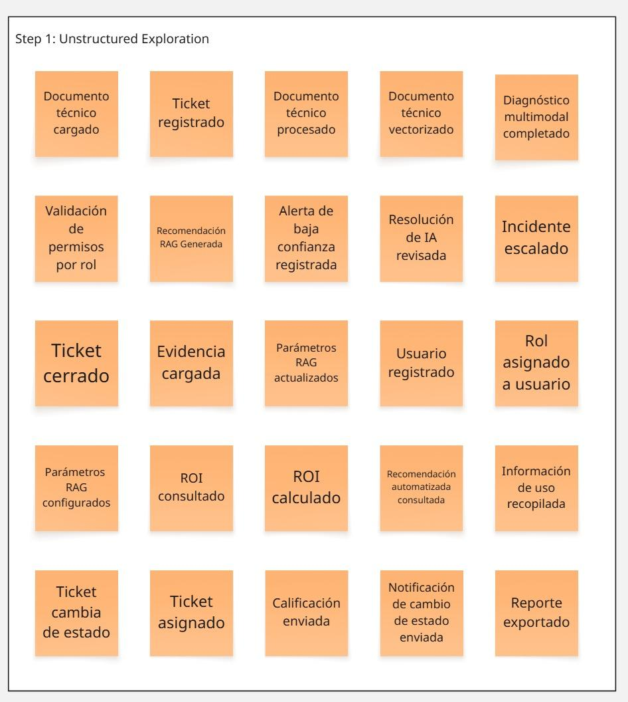

*Exploración libre de eventos de dominio sin orden temporal.*

#### Step 2: Timelines

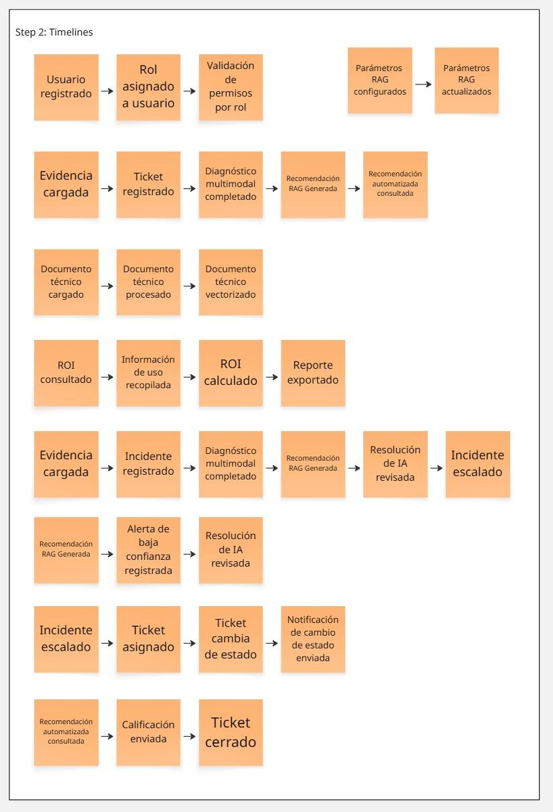

*Ordenamiento cronológico de eventos pivote a lo largo de la línea temporal.*

#### Step 3: Pain Points

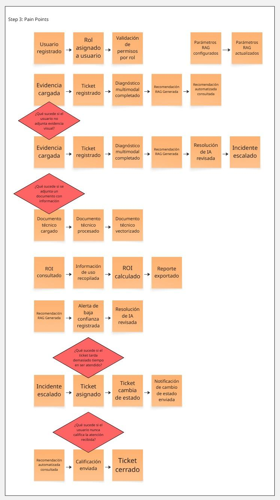

*Identificación de cuellos de botella y puntos críticos de dolor en el soporte de TI.*

#### Step 4: Pivotal Points

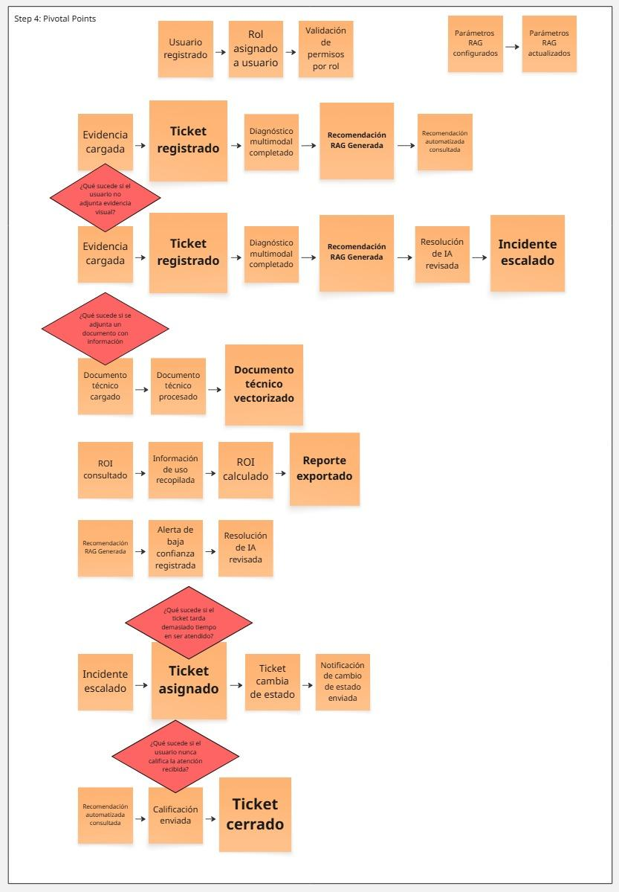

*Delimitación de eventos clave que marcan transiciones mayores de estado.*

#### Step 5: Commands

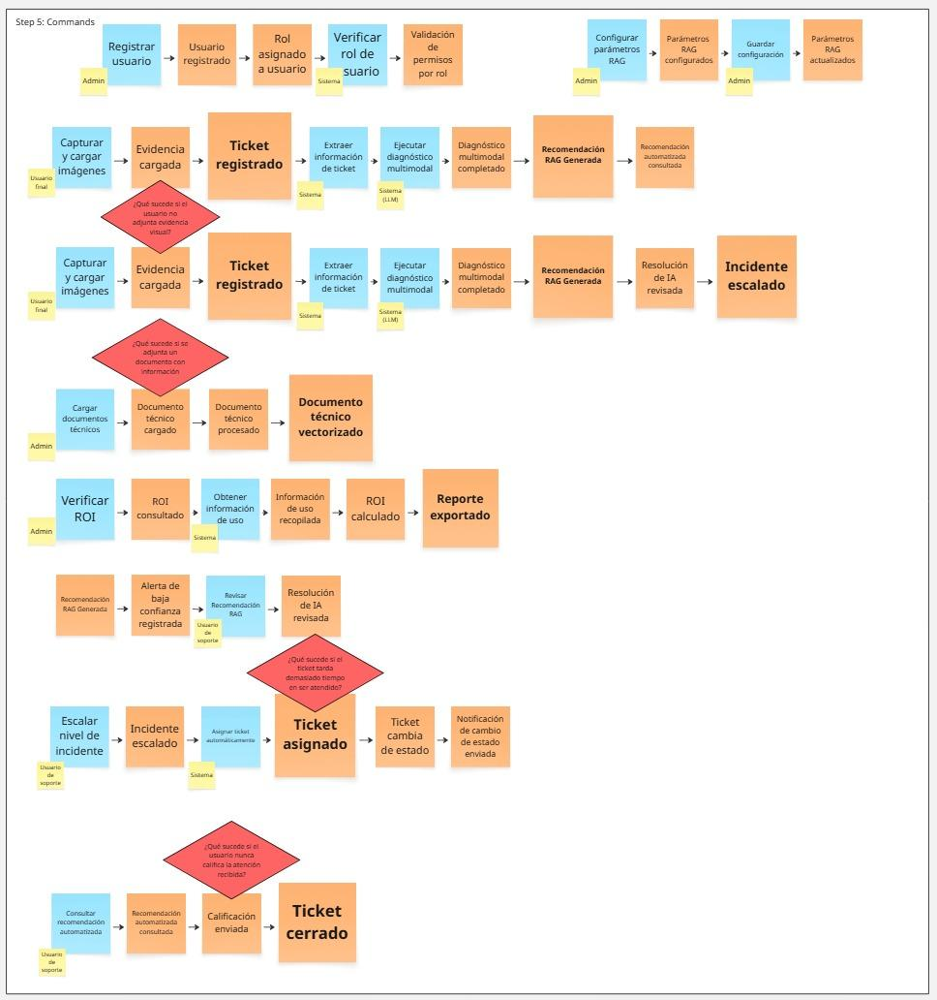

*Asociación de acciones e intenciones disparadas por los distintos actores.*

#### Step 6: Policies

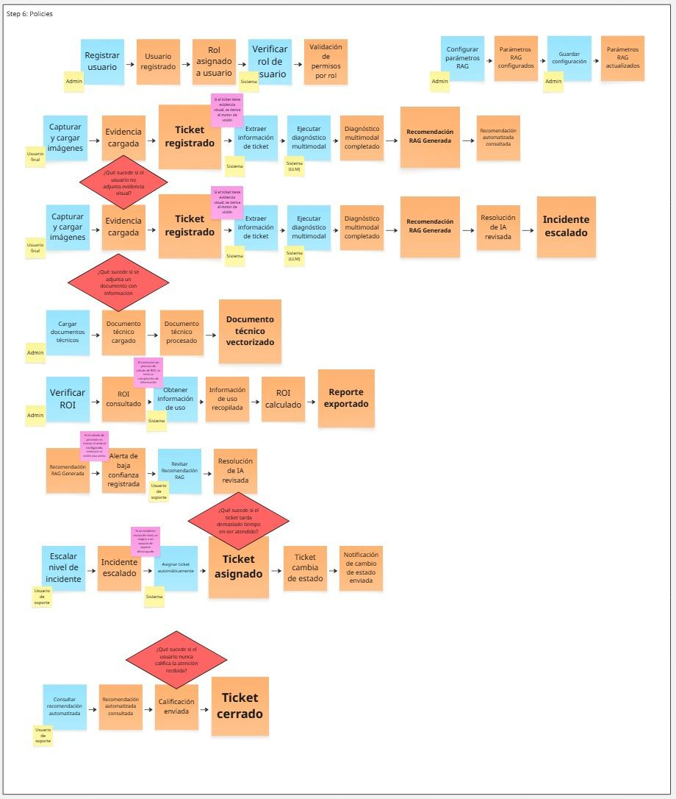

*Definición de reglas reactivas de negocio bajo la lógica Dado-Cuando-Entonces.*

#### Step 7: Read Models

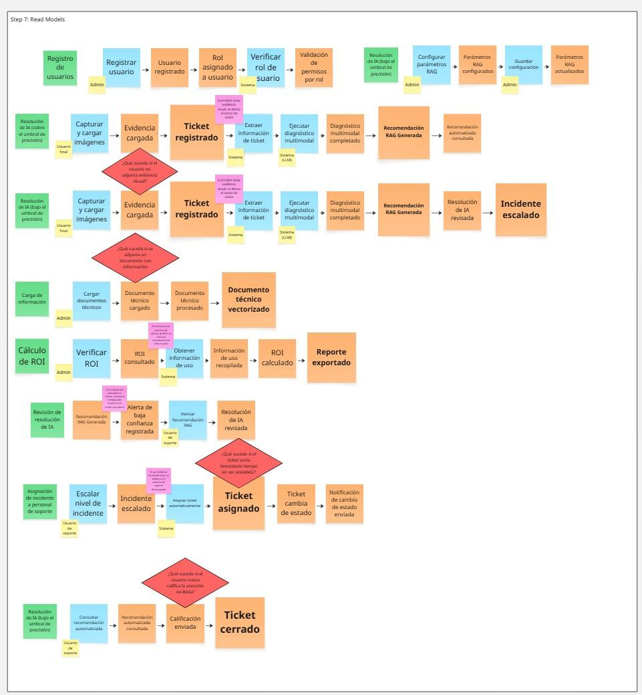

*Modelado de proyecciones y vistas de información requeridas por los usuarios.*

#### Step 8: External Systems

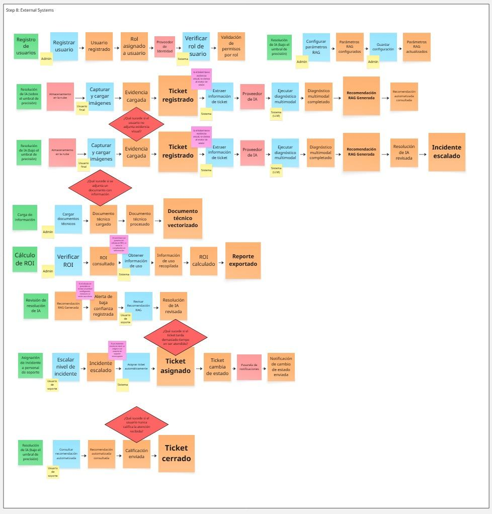

*Identificación de servicios externos y plataformas corporativas integradas.*

#### Step 9: Aggregates

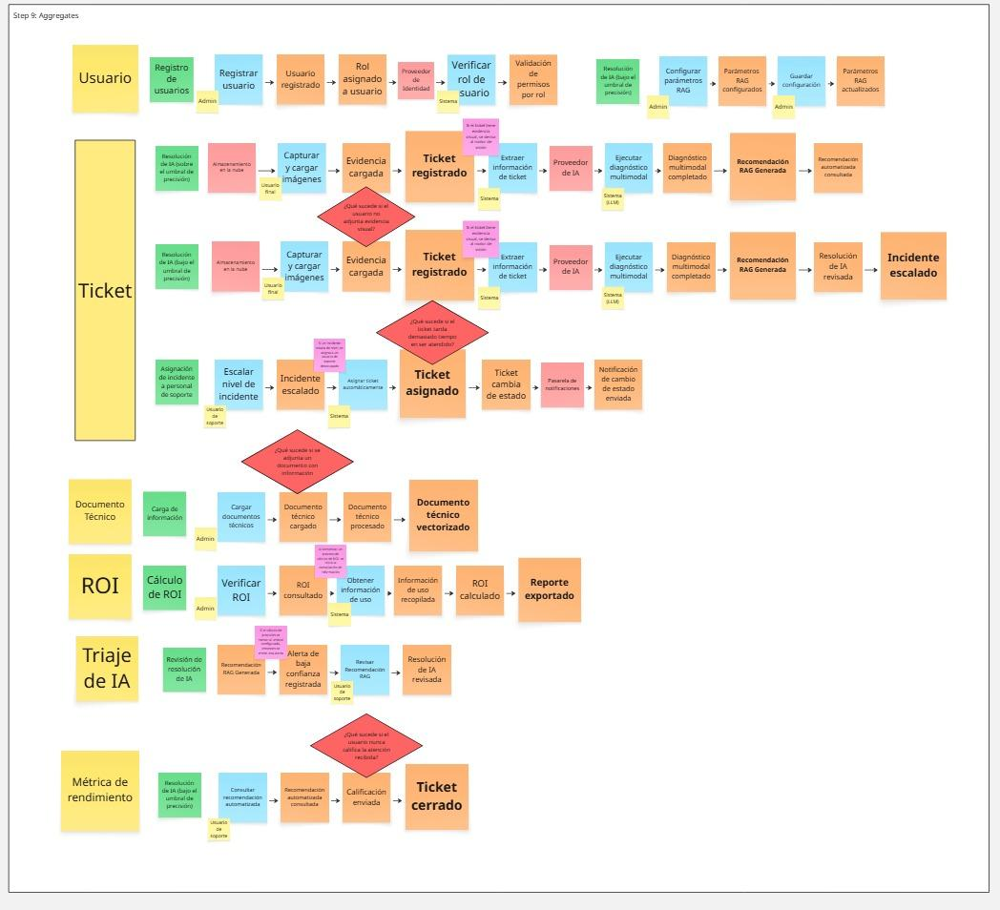

*Agrupación de entidades y reglas transaccionales dentro de límites de consistencia.*

#### Step 10: Bounded Contexts

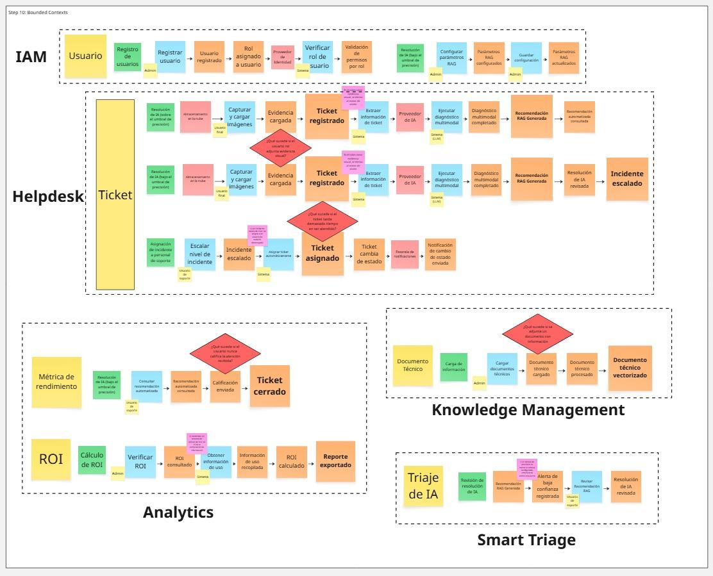

*Delimitación final de los contextos acotados del dominio estratégico de TraceHelp.*

### 4.2.2. Candidate Context Discovery

Tras la sesión de EventStorming para modelar el dominio de negocio, el equipo se enfocó en el proceso de Candidate Context Discovery con el objetivo de identificar los bounded contexts preliminares de TraceHelp. Para ello, aplicamos una combinación de técnicas: utilizamos look-for-pivotal-events para hallar eventos de dominio clave que indican cambios de estado significativos en el ciclo de vida de un ticket, start-with-simple para crear modelos con propósito y descomponer el timeline en pasos secuenciales, y start-with-value para priorizar los contextos que representan el core domain del negocio (diagnóstico mediante IA).

En primera instancia, a partir del EventStorming, se delimitaron los bounded contexts identificando los flujos de negocio clave de la plataforma. Este proceso permitió agrupar comandos, eventos y vistas relacionados para crear modelos de dominio cohesionados y bien definidos. Los contextos que emergieron de este análisis inicial, centrados en funcionalidades como el triaje inteligente, la gestión documental, la analítica ejecutiva y la administración de tickets, son el resultado de aplicar técnicas de descubrimiento que buscan aislar las partes más valiosas y críticas del soporte técnico automatizado.

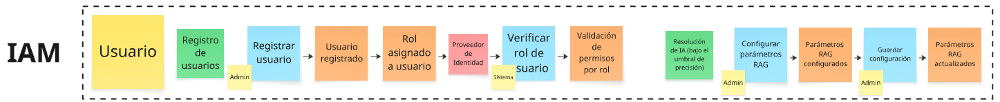

#### Bounded Context IAM (Identity and Access Management)

El Bounded Context IAM (Identity and Access Management) se centra en los comandos de "Registrar usuario" y "Verificar rol de usuario". Estas acciones son cruciales porque habilitan la interacción segura con la plataforma, asegurando que tanto administradores como analistas cuenten con los permisos adecuados antes de operar. Por esta razón, la funcionalidad se ha identificado como un dominio de soporte fundamental para el negocio. La cohesión de estas acciones, sumada a la validación de permisos por rol y la configuración de parámetros RAG por parte del administrador, justifican la delimitación de un Bounded Context independiente centrado en la seguridad y el acceso.

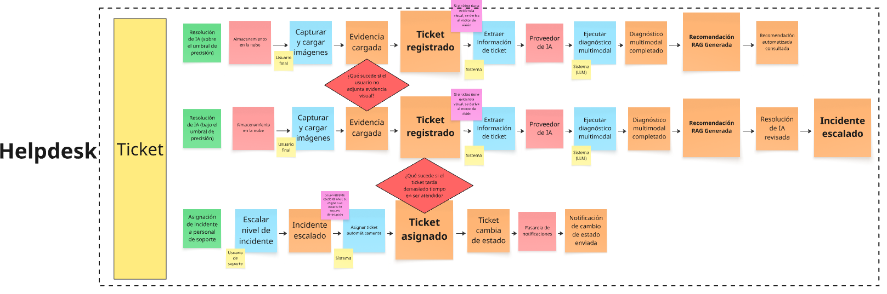

#### Bounded Context Helpdesk

El Bounded Context Helpdesk se centra en el evento pivotal "Ticket registrado" y los comandos de escalamiento y asignación. Esta acción es crucial porque representa la entrada principal del problema del usuario final a la plataforma. Esta funcionalidad se identifica como un dominio central porque la gestión del ciclo de vida del ticket es el núcleo operativo de la mesa de ayuda. La cohesión de todas las funcionalidades asociadas, desde la captura de evidencia visual (imágenes del error), la ejecución del diagnóstico multimodal, hasta el cambio de estado y la notificación al usuario, justifican su delimitación en un contexto independiente, asegurando que todo el flujo de resolución y escalamiento se gestione de forma coherente.

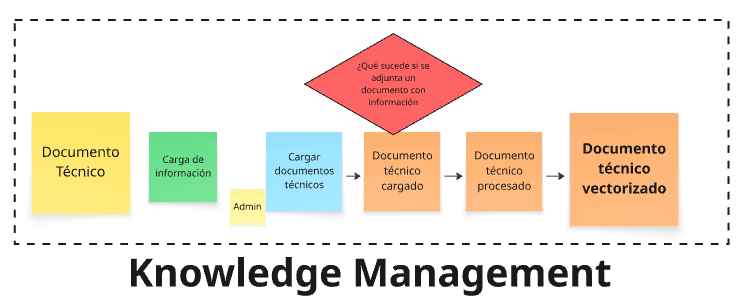

#### Bounded Context Knowledge Management

El Bounded Context Knowledge Management se centra en el comando de "Cargar documentos técnicos" y el evento de "Documento técnico vectorizado". Estas acciones, ejecutadas por un administrador, son fundamentales para el negocio, ya que alimentan la base de conocimiento que la inteligencia artificial utilizará para resolver los incidentes. Esta funcionalidad se identifica como un dominio central debido a que la precisión de las respuestas depende de esta información. La cohesión de las acciones relacionadas con la carga, procesamiento y vectorización de los manuales justifica la delimitación de un contexto independiente, permitiendo que la ingesta de conocimiento se maneje de forma centralizada y asíncrona.

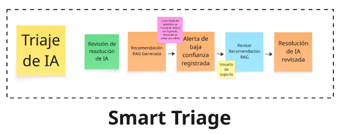

#### Bounded Context Smart Triage

El Bounded Context Smart Triage se centra en el evento de "Recomendación RAG Generada" y el manejo de las "Alertas de baja confianza". Esta funcionalidad es el núcleo de la propuesta de valor de TraceHelp, ya que ejecuta la evaluación inteligente de la IA frente a los incidentes reportados. Se identifica como el Core Domain absoluto del sistema. La cohesión de las acciones relacionadas con la revisión de la resolución de la IA, el cálculo del umbral de precisión y el flujo Human-in-the-Loop (donde el usuario de soporte revisa la recomendación), justifica la delimitación de un contexto altamente especializado e independiente, permitiendo aislar la lógica compleja del motor de inteligencia artificial.

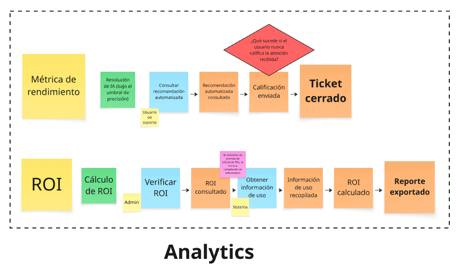

#### Bounded Context Analytics

El Bounded Context Analytics se centra en los comandos de "Consultar recomendación automatizada" para calificar la atención, y el cálculo y exportación de reportes de "ROI". Estas acciones son cruciales porque permiten la trazabilidad, la auditoría del servicio y la justificación del valor económico de la herramienta frente a la gerencia. Este dominio se identifica como un subdominio de soporte estratégico, ya que proporciona las herramientas necesarias para que los Líderes de TI monitoreen el rendimiento global de la mesa de ayuda. La cohesión de estas funcionalidades de cálculo, recopilación de uso y exportación de reportes justifica la delimitación de un contexto independiente, asegurando que la inteligencia de negocios opere sin afectar el rendimiento transaccional del sistema.

### 4.2.3. Domain Message Flows Modelling

En esta sección, el equipo explica y evidencia el proceso seguido para visualizar cómo deben colaborar los bounded contexts de TraceHelp para resolver los principales casos de negocio que se presentan para los usuarios del sistema. Para ello, se aplicó la técnica de visualización de Domain Storytelling, la cual nos permitió narrar e ilustrar gráficamente los flujos de mensajes mediante la secuencia de comandos, eventos y políticas. Este modelado evidencia las interacciones arquitectónicas entre los actores (Colaboradores, Analistas L1, Líderes de TI), los contextos delimitados (HelpDesk, Smart Triage, Knowledge Management, Analytics e IAM) y los sistemas subyacentes.

A continuación, se complementa la explicación con las capturas de los diagramas elaborados para los cuatro escenarios críticos de la solución.

#### Escenario 1: Triaje automatizado de incidente multimodal

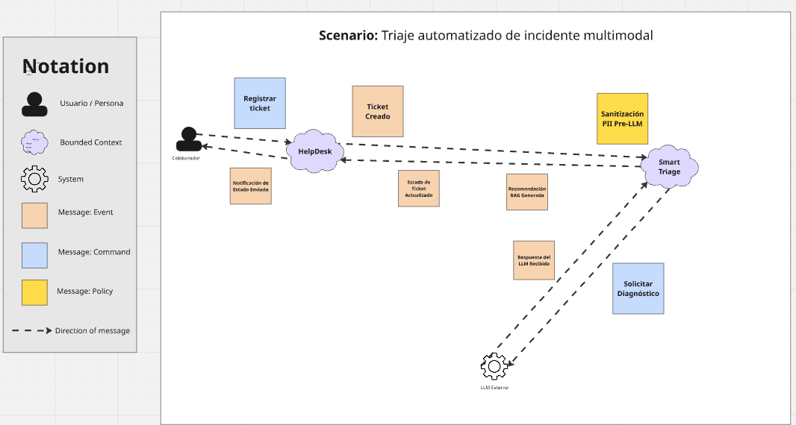

Este diagrama ilustra el flujo que sigue el sistema cuando un usuario reporta un problema técnico adjuntando evidencia visual. El proceso inicia cuando el colaborador ejecuta el comando de registrar un ticket, lo que impacta en el contexto de HelpDesk, generando el evento de ticket creado. A partir de allí, el flujo se dirige hacia el contexto de Smart Triage, donde se aplica una política de sanitización (PII Pre-LLM) para proteger datos sensibles corporativos. Una vez sanitizado, se envía un comando para solicitar el diagnóstico al sistema externo (LLM Externo). Al recibir la respuesta del LLM, el Smart Triage emite el evento indicando que la recomendación RAG ha sido generada, lo cual actualiza el estado del ticket en el HelpDesk y desencadena, finalmente, una notificación de estado enviada al colaborador.

#### Escenario 2: Validación Humana de Resolución (Human-in-the-Loop)

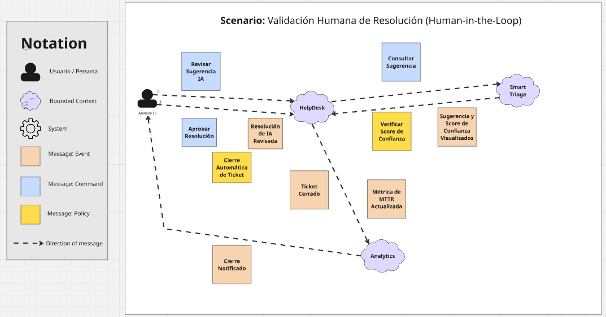

Este diagrama representa el flujo de validación humana (Human-in-the-Loop), el cual es indispensable para asegurar la exactitud del soporte técnico. El proceso comienza cuando el Analista L1, interactuando con el contexto de HelpDesk, ejecuta el comando para revisar la sugerencia de la IA, lo cual dispara una consulta hacia el Smart Triage. Tras verificar el score de confianza (política aplicada), la sugerencia es visualizada por el analista. Si el profesional aprueba la resolución mediante un comando, se genera el evento indicando que la resolución de IA ha sido revisada. Esto activa una política de cierre automático de ticket en el HelpDesk, produciendo el evento de "Ticket Cerrado", el cual simultáneamente notifica al colaborador y envía una actualización de la métrica MTTR hacia el contexto de Analytics para su registro.

#### Escenario 3: Ingesta asíncrona de manuales técnicos corporativos

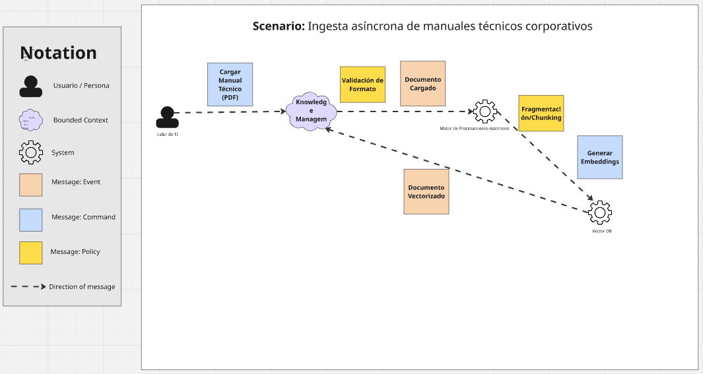

Este diagrama detalla el flujo de procesamiento de conocimiento, un pilar esencial para alimentar la arquitectura RAG. El Líder de TI inicia el proceso enviando el comando para cargar un manual técnico (por ejemplo, en formato PDF) hacia el contexto de Knowledge Management. El sistema aplica una política de validación de formato; si el documento es válido, se emite el evento de "Documento Cargado". Esto inicia un flujo hacia el sistema Motor de Procesamiento Asíncrono, donde se aplica una política de fragmentación (chunking), seguida por un comando para generar los embeddings. Estos vectores son procesados por el sistema de base de datos vectorial (Vector DB), generando finalmente el evento de "Documento Vectorizado", que retroalimenta al contexto de Knowledge Management confirmando que el manual está indexado y listo para ser consultado.

#### Escenario 4: Auditoría de roles y análisis ejecutivo de ahorro (ROI)

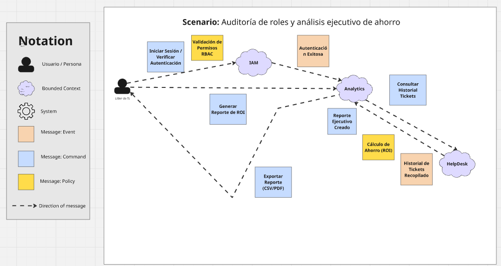

Este diagrama modela el flujo que permite a la gerencia auditar el sistema y evaluar su impacto financiero. El Líder de TI ejecuta el comando para iniciar sesión o verificar su autenticación, acción que es interceptada por el contexto IAM, donde se aplica una estricta política de validación de permisos (RBAC). Una vez emitido el evento de "Autenticación Exitosa", el líder interactúa con el contexto de Analytics mediante el comando para generar un reporte de ROI. Para realizar este cálculo, Analytics envía un comando solicitando el historial de tickets al HelpDesk, el cual responde con el evento que contiene el historial recopilado. Con esta data, Analytics aplica la política de cálculo de ahorro (ROI) y genera el evento que indica que el reporte ejecutivo ha sido creado. Finalmente, el líder extrae la información mediante el comando de exportar reporte en formatos CSV o PDF.

### 4.2.4. Bounded Context Canvases

A continuación, se presentan los Bounded Context Canvases elaborados para formalizar el diseño estratégico de cada subdominio de TraceHelp, especificando su nombre, propósito, responsabilidades, lenguaje ubicuo clave, políticas de negocio y contratos de entrada/salida:

#### Bounded Context Canvas - IAM (Identity and Access Management)

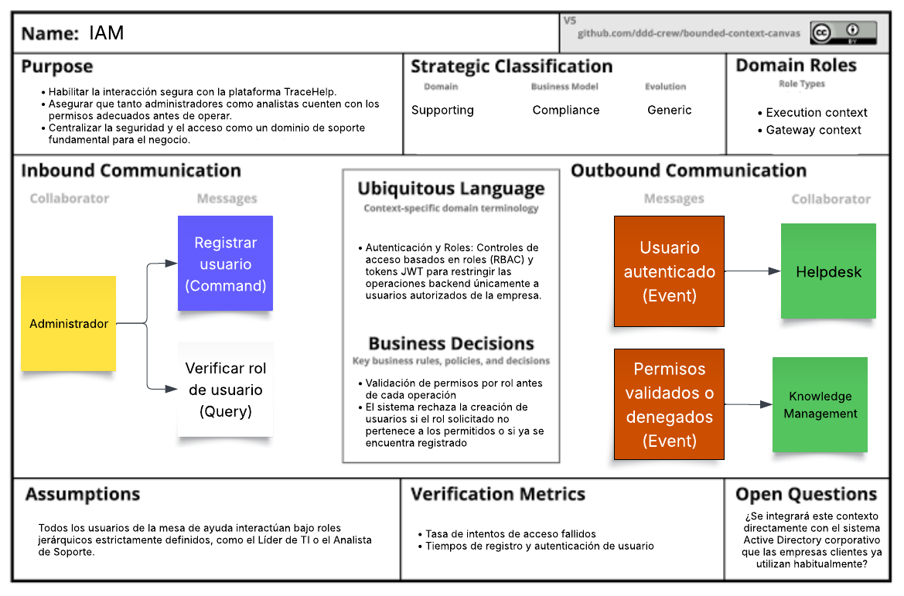

#### Bounded Context Canvas - Helpdesk

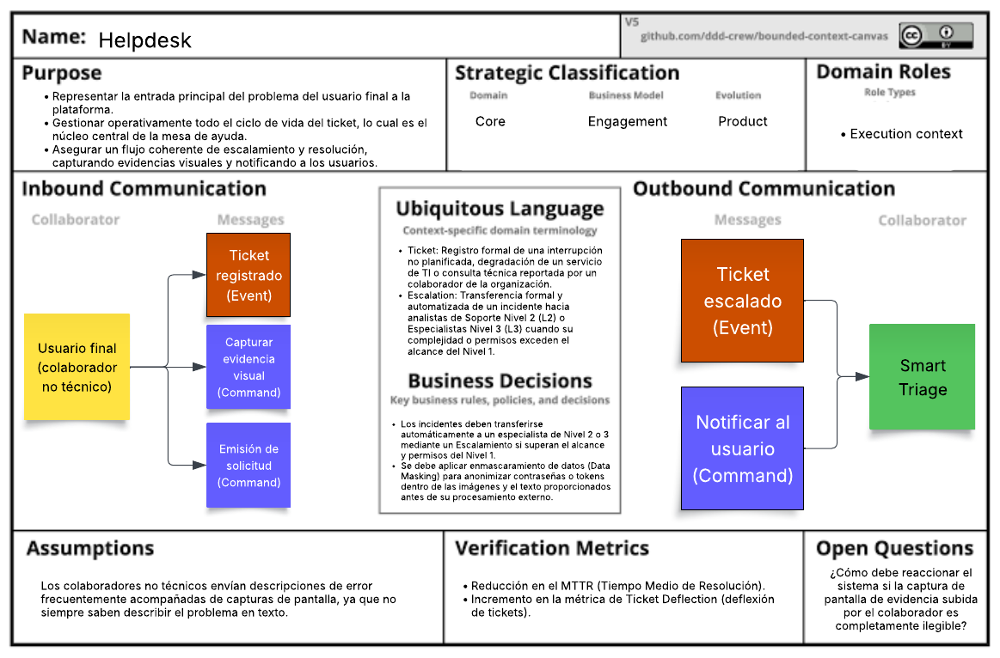

#### Bounded Context Canvas - Knowledge Management

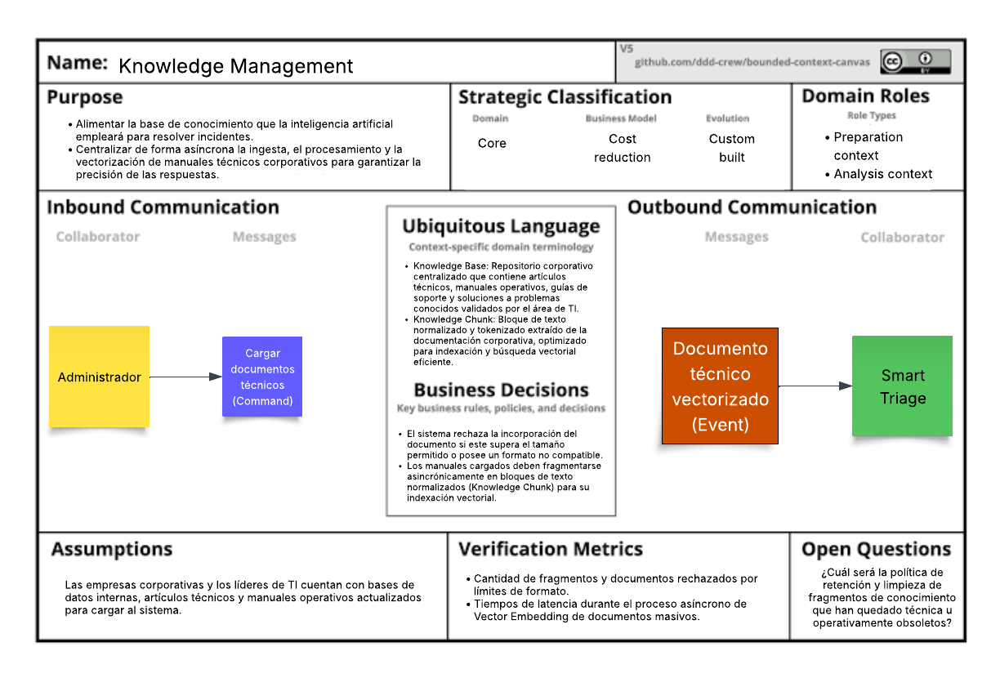

#### Bounded Context Canvas - Smart Triage

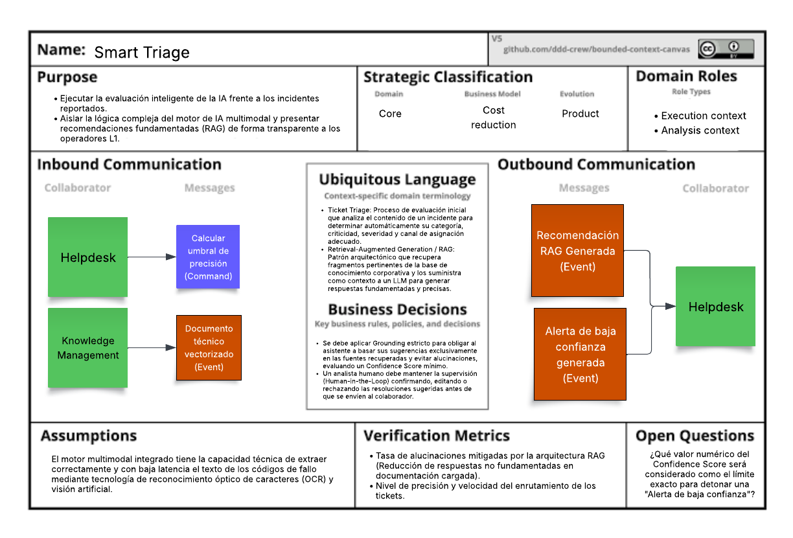

#### Bounded Context Canvas - Analytics

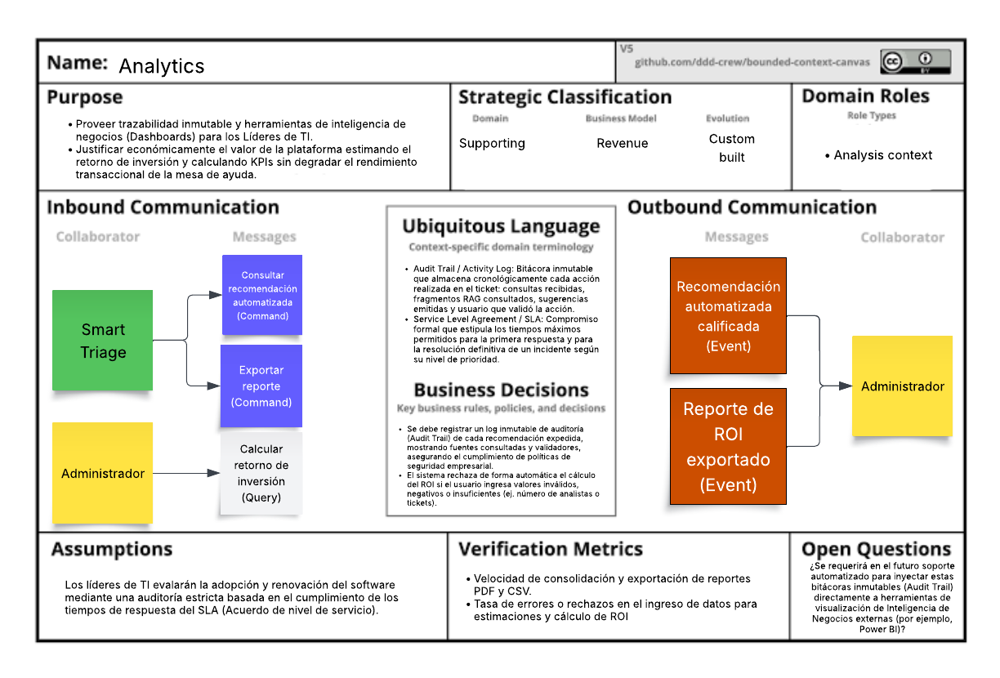

### 4.2.5. Context Mapping

#### IAM → Otros Contextos

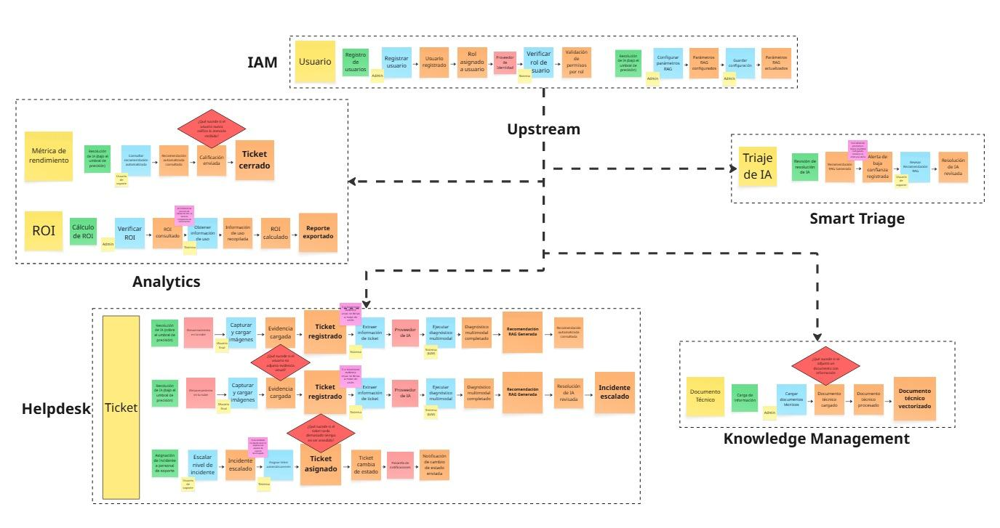

Todos los módulos necesitan saber quién está ejecutando la acción (Usuario final, Administrador, Personal de soporte). Si el modelo de permisos de IAM cambia, los demás contextos deben adaptarse. Los demás contextos asumen y consumen la identidad sin cuestionarla (se conforman a su modelo).

#### Knowledge Management → Helpdesk

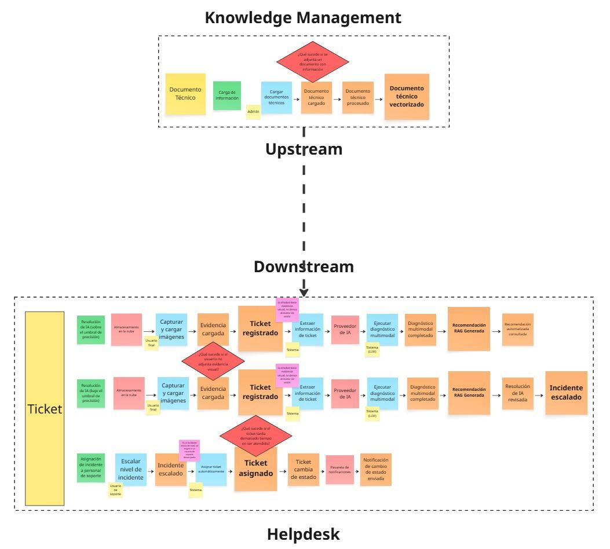

En el sistema, Knowledge Management se encarga de que un documento técnico sea procesado y vectorizado. El Helpdesk consume esta base de conocimiento vectorizada para funcionar. Helpdesk (Customer) depende de que Knowledge Management (Supplier) alimente bien el vector store.

#### Helpdesk ↔ Smart Triage

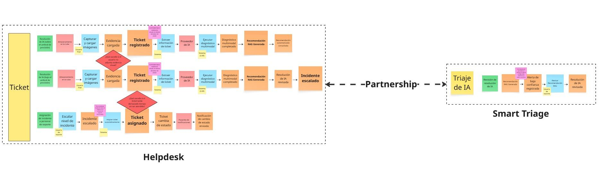

Helpdesk genera la recomendación RAG y si el diagnóstico multimodal tiene baja precisión, dispara una alerta (Upstream).

Smart Triage toma la alerta, el equipo de soporte la revisa y emite una revisión. Este evento vuelve a impactar al Helpdesk para que el incidente pueda ser cerrado o escalado. (Downstream)

Dado que comparten directamente eventos del ciclo de vida de la resolución, un Partnership (asociación) donde ambos equipos coordinan fuertemente sus modelos es lo más adecuado.

#### Helpdesk → Analytics

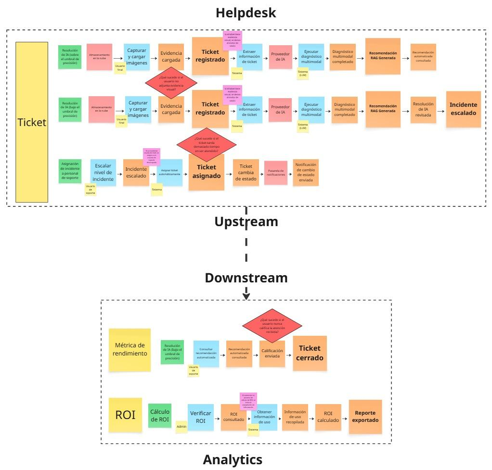

Analytics necesita saber cuándo un ticket cambia de estado, cuándo se envía una calificación y cuánto uso se le da a la IA para el "Cálculo de ROI". Analytics solo escucha lo que sucede en el Helpdesk. Si el Helpdesk cambia su modelo, Analytics podría usar una capa anticorrupción (ACL) para no romper sus tableros de métricas.

#### IAM → Helpdesk (Configuración RAG)

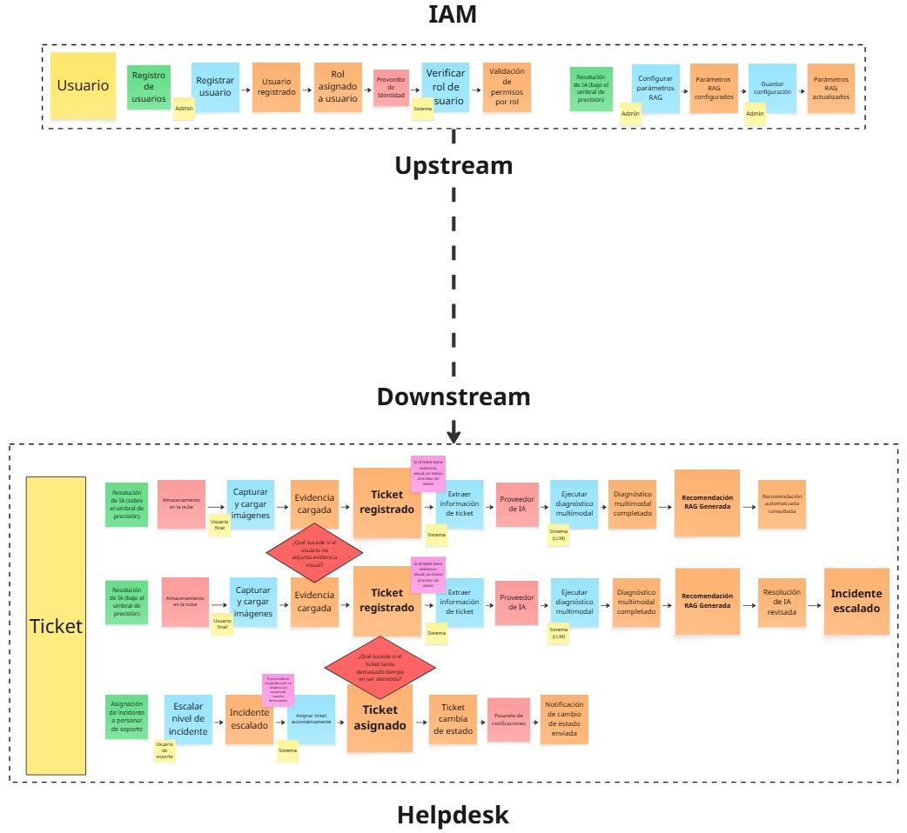

El administrador (cuyo rol es verificado a través del contexto de IAM) dicta las reglas de cómo el LLM del Helpdesk se comporta. Helpdesk es estrictamente Downstream de estas configuraciones.

## 4.3. Software Architecture

Esta sección detalla la arquitectura de software de TraceHelp utilizando el estándar C4 Model, desglosando el sistema desde su ecosistema corporativo más amplio hasta el despliegue físico de sus contenedores.

### 4.3.1. Software Architecture System Landscape

El System Landscape de TraceHelp representa el ecosistema corporativo completo de la organización cliente, no limitándose únicamente a la herramienta de asistencia con IA, sino abarcando todos los sistemas que sostienen la operación tecnológica de la empresa. El Sistema TraceHelp interactúa de manera estrecha con el Sistema ITSM Corporativo, el cual actúa como el maestro de datos donde residen los tickets originales y el historial de usuarios. Además, el entorno cuenta con un Directorio Activo (Active Directory / IAM Corporativo) que gestiona la identidad centralizada y los roles de todos los colaboradores de la empresa. Externamente, TraceHelp depende de un Proveedor Cloud de LLM para el procesamiento de lenguaje natural y de un Servicio de Notificaciones para enviar alertas a los usuarios sobre el estado de sus incidentes.

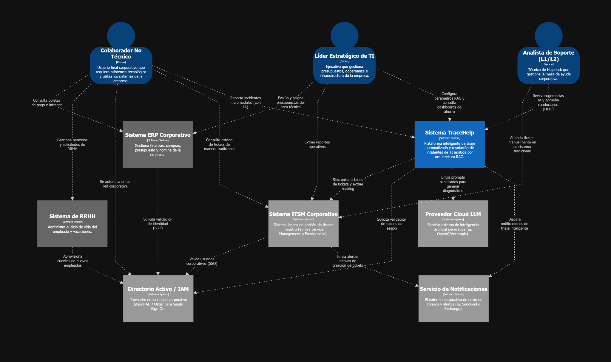

### 4.3.2. Software Architecture Context Level Diagrams

El diagrama de System Context sitúa al Sistema TraceHelp como el núcleo de la solución de triaje automatizado, definiendo sus límites operativos y las interacciones directas con su entorno. En este nivel de abstracción, se detallan las interfaces con los actores humanos: el Colaborador No Técnico que envía reportes multimodales, el Analista de Soporte que valida las sugerencias, y el Líder Estratégico de TI que configura el sistema y revisa los tableros de retorno de inversión (ROI). Para operar, el sistema central actúa como un orquestador que consume los incidentes registrados en el Sistema ITSM corporativo, valida las identidades mediante el Directorio Activo, delega el análisis semántico pesado al Proveedor de LLM externo, asegurándose siempre de aplicar políticas de enmascaramiento de datos antes de enviar la información, y despacha avisos a través del Servicio de Notificaciones.

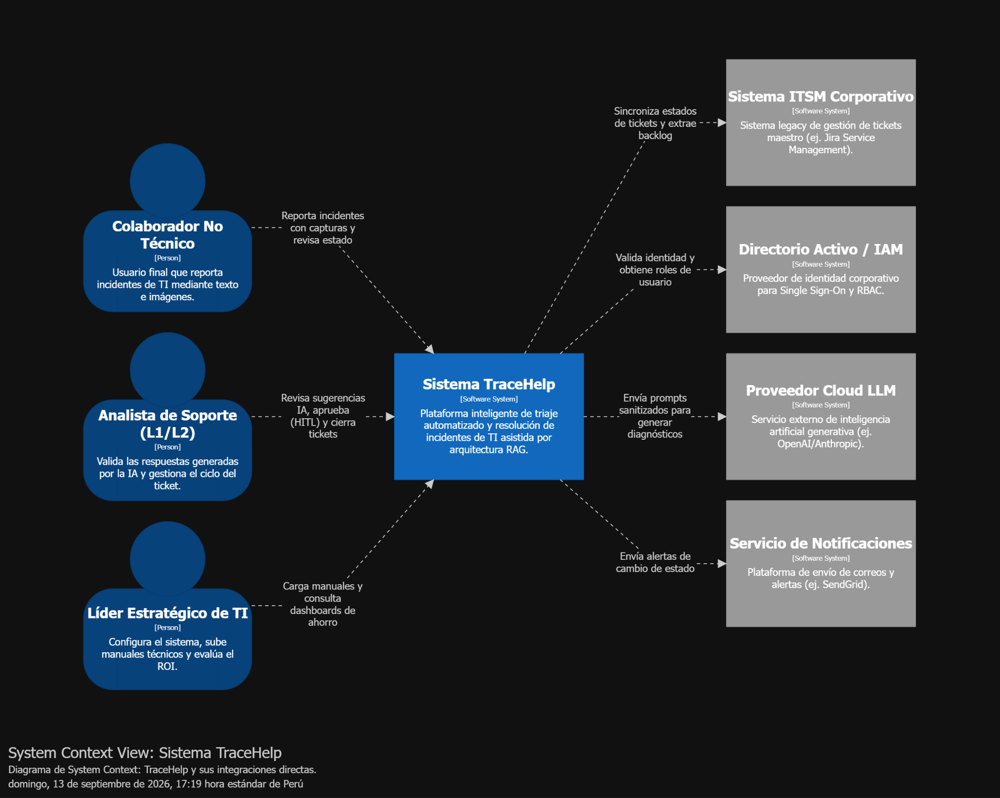

### 4.3.3. Software Architecture Container Level Diagrams

El diagrama de contenedores de TraceHelp presenta la arquitectura interna de la solución organizada en un esquema de microservicios cloud-native. La capa de interacción agrupa dos interfaces en formato Single Page Application (SPA): el Portal de Autoservicio y Tablero de Operaciones utilizado por colaboradores y analistas, y el Dashboard Ejecutivo para los líderes de TI. Toda la comunicación desde el exterior es canalizada por un API Gateway, que centraliza la seguridad, el enrutamiento y la validación de tokens JWT.

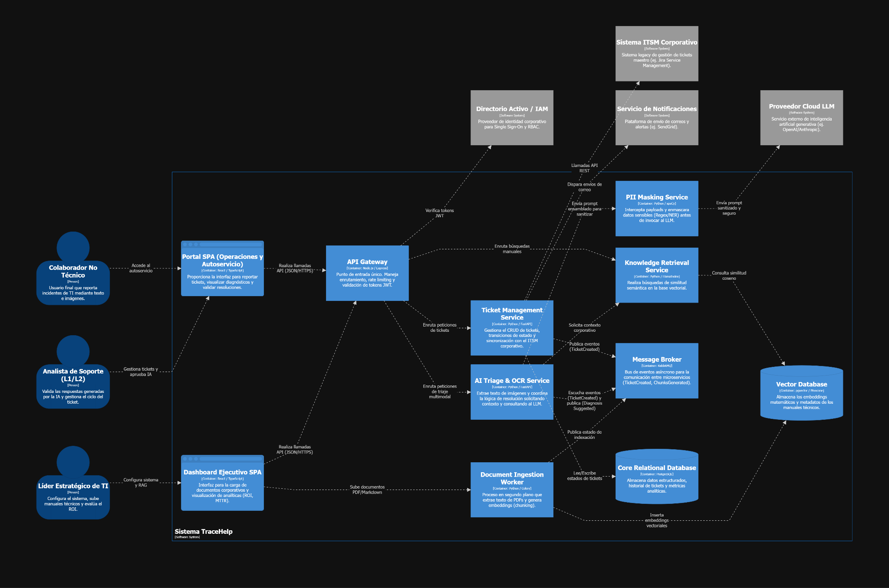

Detrás del Gateway, operan cinco microservicios especializados: el Ticket Management Service administra el ciclo de vida del incidente y se comunica con bases de datos relacionales; el Document Ingestion Worker procesa asíncronamente los manuales cargados mediante tareas en segundo plano; el Knowledge Retrieval (RAG) Service interactúa con la Vector DB para extraer contexto semántico; el AI Triage & OCR Service extrae texto de imágenes y ensambla los prompts; y el crítico PII Masking Service, encargado de interceptar y anonimizar todos los datos sensibles antes de que el Triage Service consulte al LLM externo. Finalmente, un Message Broker (RabbitMQ o Kafka) maneja la comunicación asíncrona mediante eventos como TicketCreated, ChunksGenerated o DiagnosisSuggested, desacoplando los servicios y garantizando la tolerancia a fallos.

### 4.3.4. Software Architecture Deployment Diagrams

El Deployment Diagram de TraceHelp describe la distribución física de los contenedores en un entorno de producción basado en la nube. Los usuarios finales (colaboradores, analistas y líderes) acceden a las aplicaciones SPA desde estaciones de trabajo corporativas. Toda la infraestructura de backend se despliega dentro de un Virtual Private Cloud en AWS o Azure, utilizando un clúster de Kubernetes para la orquestación de contenedores.

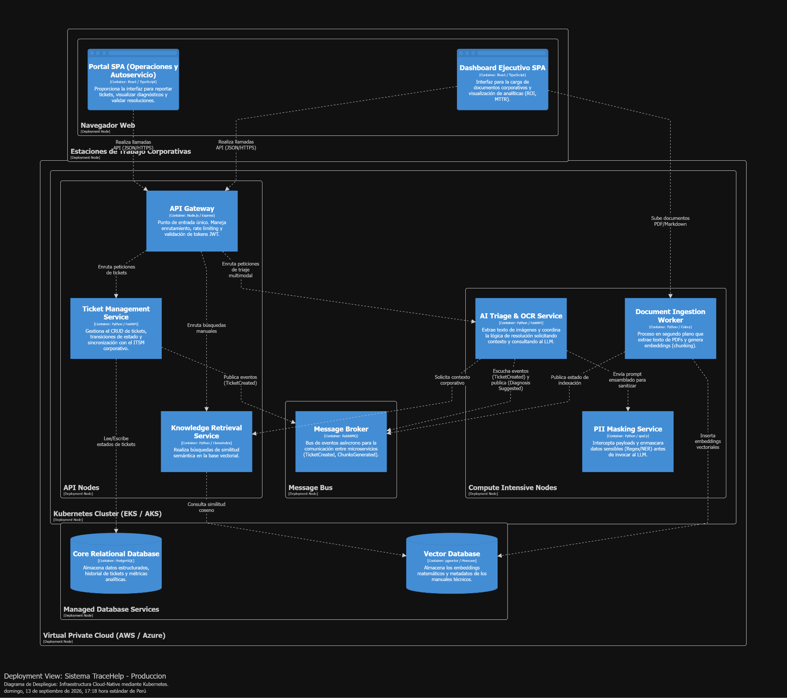

Dentro del clúster, el tráfico ingresa mediante un Ingress Controller hacia el API Gateway. Los microservicios corren en múltiples réplicas distribuidas en Worker Nodes según la demanda de CPU y memoria. El Message Broker (RabbitMQ) también se despliega en contenedores de alta disponibilidad. La capa de persistencia utiliza servicios gestionados: Amazon RDS for PostgreSQL para los datos maestros y analíticos, y un cluster de base de datos vectorial gestionado para los embeddings. El diagrama ilustra claramente que la comunicación con la API del LLM Externo y el Directorio Activo se realiza a través de conexiones seguras HTTPS de salida, garantizando que el filtrado de PII ocurra estrictamente dentro del perímetro del cliente corporativo.
